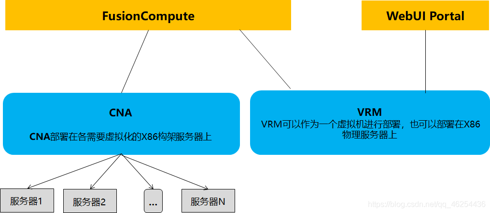
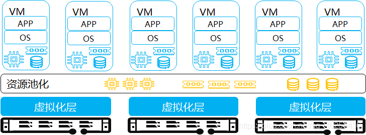
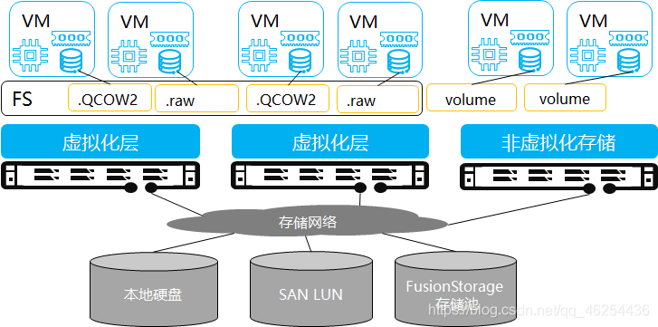
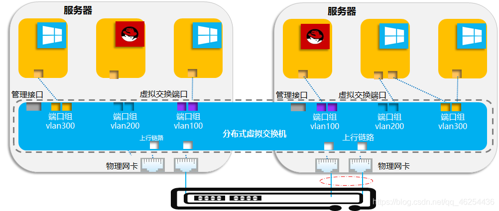
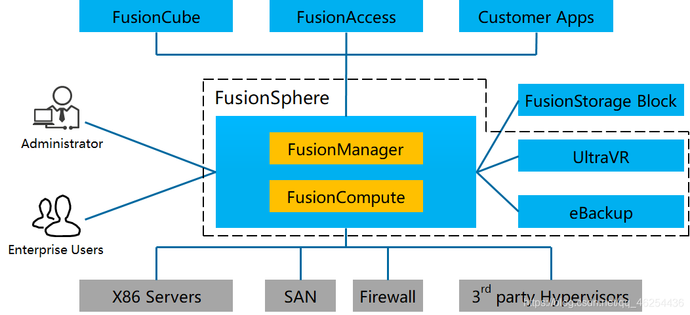
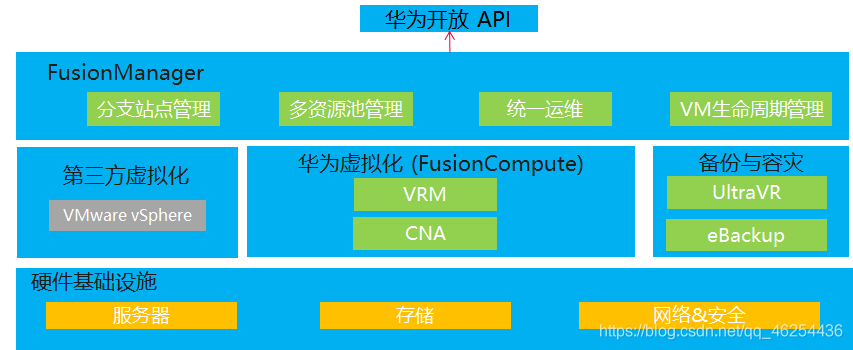

#知识管理/云计算 

## FusionCompute

虚拟化平台，主要负责硬件资源的虚拟化，以及对虚拟资源、业务资源、用户资源的集中管理

**VRM**(Virtual Resource Management)，部署成VM或者部署在物理服务器上，可以接管CNA，对外提供网页操作界面供管理维护人员。
VRM对应Vmware的Vcenter。
角色：管理、调度（管家）、监控
服务对象：平台外操作
主要功能：

1. 管理集群内的块存储资源
2. 管理集群内的网络资源(IP/VLAN)，为虚拟机分配IP地址
3. 管理集群内虚拟机的生命周期以及虚拟机在计算节点上的分布和迁移
4. 管理集群内资源的动态调整
5. 通过对虚拟资源、用户数据的统一管理，对外提供弹性计算、存储、IP等服务
6. 通过提供统一的操作维护管理接口，操作维护人员通过WebUI远程访问FusionCompute对整个系统进行操作维护，包含资源管理、资源监控、资源报表等。

**CNA**(Compute Node Agent)计算代理，定制的Linux操作系统，独立的ISO文件，部署在需要虚拟化的服务器上(物理机)，提供运算能力(CPU MEM)，本地硬盘只用来装操作系统本身，数据盘在共享存储中划出空间。
CNA对应Vmware的ESXi。
角色：管理、调度、监控
服务对象：VRM
主要功能：

1. 提供虚拟计算功能  
2. 管理计算节点上的虚拟机  
3. 管理计算节点上的计算、存储、网络资源

UVP：
角色：实施者
服务对象：CNA
主要功能：

1. 接受CNA的任务调度，执行任务并反馈执行结果；
2. 实现对虚拟机的监控和管控；

### 虚拟化计算

FusionCompute支持将x86服务器虚拟化为多台虚拟机，最终用户可以在这些虚拟机上安装各种软件，挂载磁盘，调整配置，调整网络，就像普通的x86服务器一样使用它。
对于最终用户，虚拟机比物理机的优势在于它可以很快速的发放，很方便的调整配置和组网。对于维护人员来讲，虚拟机复用了硬件，这样硬件更少，加上云平台的自动维护能力，维护成本显著降低。对于系统管理员，可以很直观的知道资源使用的总量及变化趋势，以便决策是否扩容。

将服务器物理资源抽象成逻辑资源，让一台服务器变成几台甚至上百台相互隔离的虚拟服务器，不再受限于物理上的界限，而是让CPU、内存、磁盘、I/O等硬件变成可以动态管理的“资源池”，从而提高资源的利用率，简化系统管理。同时硬件辅助虚拟化技术提升虚拟化效率，增加虚拟机的安全性。

### 虚拟化存储

FusionCompute支持将SAN设备、计算节点本地存储以及FusionStorage提供的虚拟存储空间统一管理，以虚拟卷的形式分配给虚拟机使用。

存储设备的能力、接口协议等差异性很大，存储虚拟化技术可以将不同存储设备进行格式化，将各种存储资源转化为统一管理的数据存储资源，可以用来存储虚拟机磁盘、虚拟机配置信息、快照等信息。用户对存储的管理更加同质化。
虚拟机磁盘、快照等内存均以文件的形式存放在数据存储上，所有业务操作均可以转化成对文件的操作，操作更加直观、便捷。
基于存储虚拟化平台提供的众多存储业务，可以提高存储利用率，更好的可靠性、可维护性、可以带来更好的业务体验和用户价值。
华为提供基于主机的存储虚拟化功能，用户不需要再关注存储设备的类型和能力。存储虚拟化可以将存储设备进行抽象，以逻辑资源的方式呈现，统一提供全面的存储服务。可以在不同的存储形态，设备类型之间提供统一的功能。
对于最终用户，就像x86服务器使用本地硬盘一样的方式使用，可以格式化，安装文件系统，安装操作系统，读写。同时，虚拟化的存储还具备快照能力，可以调整大小，这是物理硬盘不能实现的。
对于管理员来说，虚拟存储卷并不一对一映射到某块具体的磁盘，而是收敛到几台SAN设备。由于SAN设备已经有了可靠性保障，所以更换硬盘的工作量大规模下降。同时，虚拟存储具备瘦分配，灵活调整，QoS可限制，可迁移等等比物理盘强的特性，在整体成本方面优势很明显。

### 虚拟化网络

FusionCompute具备支持分布式虚拟交换，可以向虚拟机提供独立的网络平面。像物理交换机一样，不同的网络平面间通过VLAN进行隔离。

分布式虚拟交换机
分布式交换机的功能类似于普通的物理交换机，每台主机都连接到分布式交换机中。分布式交换机的一端是与虚拟机相连的虚拟端口，另一端是与虚拟机所在主机上的物理以太网适配器相连的上行链路。通过它可以连接主机和虚拟机，实现系统网络互通。另外，分布式交换机在所有关联主机之间作为单个虚拟交换机使用。此功能可使虚拟机在跨主机进行迁移时确保其网络配置保持一致。

## 华为虚拟化：

FusionSphere

1. FusionCumper-虚拟化套件
2. FusionManager-虚拟池化套件

- 帮助客户提升数据中心基础设施的资源利用率
- 帮助客户成倍缩短业务上线周期
- 帮助客户成倍降低数据中心能耗
- 利用虚拟化基础设施的高可用和强恢复能力，实现业务快速自动化故障恢复，降低数据中心成本和增加系统应用的正常运行时间

### FusionSphere虚拟化套件组成：

### FusionSphere服务器虚拟化架构

