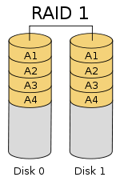

## RAID

廉价冗余磁盘阵列(Redundant Array of Inexpensive Disks)，将多个容量较小、相对廉价的磁盘进行有机组合，从而以较低的成本获得与昂贵大容量磁盘相当的容量、性能、可靠性。随着磁盘成本和价格的不断降低，RAID 变成了独立磁盘冗余阵列(Redundant Array of Independent Disks)。

 - RAID主要利用数据条带、镜像和数据校验技术来获取高性能、可靠性、容错能力和扩展性，根据运用或组合运用这三种技术的策略和架构，可以把 RAID 分为不同的等级，以满足不同数据应用的需求。
 - RAID 被看作是由两个或更多磁盘组成的存储空间，通过并发地在多个磁盘上读写数据来提高存储系统的 I/O 性能。大多数 RAID 等级具有完备的数据校验、纠正措施，从而提高系统的容错性，甚至镜像方式，大大增强系统的可靠性。
 - 通过把相同数据同时写入到多块磁盘（典型地如镜像），或者将计算的校验数据写入阵列中来获得冗余能力，当单块磁盘出现故障时可以保证不会导致数据丢失。有些 RAID 等级允许更多地 磁盘同时发生故障，比如 RAID6 ，可以是两块磁盘同时损坏。在这样的冗余机制下，可以用新磁盘替换故障磁盘， RAID 会自动根据剩余磁盘中的数据和校验数据重建丢失的数据，保证数据一致性和完整性。
 - 磁盘阵列会减少全体磁盘的总可用存储空间，牺牲空间换取更高的可靠性和性能。比如，RAID1 存储空间利用率仅有 50% ， RAID5 会损失其中一个磁盘的存储容量，空间利用率为 (n-1)/n 。
 - 目前业界公认的标准是 RAID0 ~ RAID5 ，除 RAID2 外的四个等级被定为工业标准，而在实际应用领域中使用最多的 RAID 等级是 RAID0 、 RAID1 、 RAID3 、 RAID5 、 RAID6 和 RAID10。

### RAID的三大关键技术

1. 镜像(Mirroring)
	将数据复制到多个磁盘，一方面可以提高可靠性，另一方面可并发从两个或多个副本读取数据来提高读性能。显而易见，镜像的写性能要稍低， 确保数据正确地写到多个磁盘需要更多的时间消耗。
2. 数据条带(Data Stripping)
	将数据分片保存在多个不同的磁盘，多个数据分片共同组成一个完整数据副本，这与镜像的多个副本是不同的，它通常用于性能考虑。数据条带具有更高的并发粒度，当访问数据时，可以同时对位于不同磁盘上数据进行读写操作， 从而获得非常可观的 I/O 性能提升 。
3. 数据校验(Data parity)
	利用冗余数据进行数据错误检测和修复，冗余数据通常采用海明码、异或操作等算法来计算获得。利用校验功能，可以很大程度上提高磁盘阵列的可靠性、鲁棒性和容错能力。不过，数据校验需要从多处读取数据并进行计算和对比，会影响系统性能。
### RAID等级

1. RAID0：条带化磁盘阵列，磁盘>=2组成，性能在所有 RAID 等级中是最高的，它不提供数据冗余保护，一旦数据损坏，将无法恢复。 RAID0 一般适用于对性能要求严格但对数据安全性和可靠性不高的应用，如视频、音频存储、临时数据缓存空间等。
	
	
2. RAID1：称为镜像,将数据完全一致地分别写到工作磁盘和镜像磁盘，它的磁盘空间利用率为 50%,  一旦工作磁盘发生故障，系统自动从镜像磁盘读取数据，不会影响用户工作。RAID1 应用于对顺序读写性能要求高以及对数据保护极为重视的应用，如对邮件系统的数据保护。
	
	
3. RAID3：采用一个专用的磁盘作为校验盘，其余磁盘作为数据盘，至少需要三块磁盘，不同磁盘上同一带区的数据作 XOR 校验，校验值写入校验盘中。RAID3 完好时读性能与 RAID0 完全一致，向 RAID3 写入数据时，必须计算与所有同条带的校验值，并将新校验值写入校验盘中。一次写操作包含了写数据块、读取同条带的数据块、计算校验值、写入校验值等多个操作，系统开销非常大，性能较低。RAID3 中某一磁盘出现故障，不会影响数据读取，可以借助校验数据和其他完好数据来重建数据。适用大容量数据的顺序访问应用，如影像处理、流媒体服务等。

4. RAID5：校验数据分布在阵列中的所有磁盘上，是目前综合性能最佳的数据保护解决方案。 RAID5 基本上可以满足大部分的存储应用需求，数据中心大多采用它作为应用数据的保护方案。
	
	
5. RAID6：双重校验，校验位分布在所有盘中，它可以保护阵列中同时出现两个磁盘失效时，阵列仍能够继续工作，不会发生数据丢失。 存储空间为SUM-2 容错性更高，RAID6 很少得到实际应用，主要用于对数据安全等级要求非常高的场合。它一般是替代 RAID10 方案的经济性选择。
	

6. RAID10和RAID10：RAID01 是先做条带化再作镜像，本质是对物理磁盘实现镜像；而 RAID10 是先做镜像再作条带化，是对虚拟磁盘实现镜像。相同的配置下，通常 RAID01 比 RAID10 具有更好的容错能力。整体磁盘利用率均仅为 50%。
	
	
7. RAID50:
	

顺序IO建议RAID5
随机小IO建议RAID10