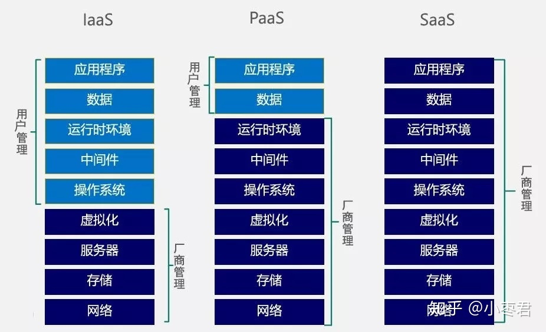
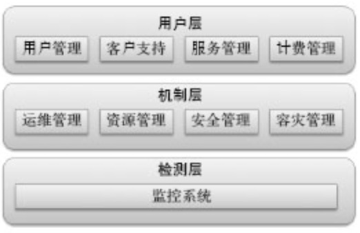

#知识管理/云计算

## 什么是云计算

厂商通过分布式计算和[虚拟化](虚拟化.md)技术搭建数据中心或超级计算机，以免费或按需租用方式向技术开发者或者企业客户提供数据存储、分析以及科学计算等服务，云计算的“云“就是存在于互联网上的服务器集群上的资源，它包括硬件资源（服务器、存储器、CPU等）和软件资源（如应用软件、集成开发环境等），本地计算机只需要通过互联网发送一个需求信息，远端就会有成千上万的计算机提供需要的资源并将结果返回到本地计算机，这样，本地计算机几乎不需要做什么，所有的处理都在云计算提供商所提供的计算机群来完成。

## 优势

- 按需自助服务
- 广泛的网络接入
- 资源池化
- 快速弹性伸缩
- 可计量服务 

## 特点

 - 虚拟化技术
 - 动态可扩展性
 - 按需部署
 - 灵活性高
 - 可靠性高
 - 性价比高
 - 地理分布
 - 先进安全技术

# 云服务层(服务模式)

## SaaS

SaaS（Service as a Service，PaaS）服务提供商将应用软件统一部署在自己的服务器上，用户根据需求通过互联网向厂商订购应用软件服务，服务提供商根据客户所定软件的数量、时间长短等因素费，并且通过浏览器向客户提供软件的模式。

软件厂商可以通过四个因素提高ROI（投资回报）：提高部署的速度、增加用户接受率、减少支持的需要、降低实现和升级的成本。

## PaaS

平台即服务（Platform as a Service，PaaS）厂商提供开发环境、服务器平台、硬件资源等服务给客户，用户在其平台基础上开发自己的应用程序并通过其服务器和互联网传递给其他客户。PaaS能够给企业或个人提供研发的中间件平台，提供应用程序开发、数据库、应用服务器、试验、托管及应用服务。
通过PaaS这种模式，用户可以在一个提供SDK（Software Development Kit，即软件开发工具包）、文档、测试环境和部署环境等在内的开发平台上非常方便地编写和部署应用，而且不论是在部署，还是在运行的时候，用户都无需为服务器、 操作系统、网络和存储等资源的运维而操心，这些繁琐的工作都由PaaS云供应商负责。

### 优势

1. 友好的开发环境：通过提供SDK和IDE（Integrated Development Environment ，集成开发环境）等工具来让用户不仅能在本地方便地进行应用的开发和测试，而且能进行远程部署
2. 丰富的服务：PaaS平台会以API的形式将各种各样的服务提供给上层的应用
3. 精细的管理和监控：PaaS能够提供应用层的管理和监控，比如能够观察应用运行的情况和具体数值（比如吞吐量和响应时间等）来更好地衡量应用的运行状态，还有能够通过精确计量应用使用所消耗的资源来更好地计费
4. 伸缩性强： PaaS 平台会自动调整资源来帮助运行于其上的应用更好地应对突发流量
5. 多租户（Multi-Tenant）机制：许多PaaS平台都自带多租户机制，不仅能更经济地支撑庞大的用户规模，而且能提供一定的可定制性以满足用户的特殊需求
6. 整合率和经济性：PaaS平台整合率是非常高

### 常见技术

1. REST ：通过 REST（Representational State Transfer，表述性状态转移）技术，能够非常方便和优雅地将中间件层所支撑的部分服务提供给调用者
2. 多租户：就是能让一个单独的应用实例可以为多个组织服务，而且能保持良好的隔离性和安全性，并且通过这种技术，能有效地降低应用的购置和维护成本
3. 并行处理：为了处理海量的数据，需要利用庞大的x86集群进行规模巨大的并行处理，Google的MapReduce是这方面的代表之作
4. 应用服务器：在原有的应用服务器的基础上为云计算做了一定程度的优化
5. 分布式缓存：通过分布式缓存技术，不仅能有效地降低对后台服务器的压力，而且还能加快相应的反应速度

## IaaS

基础架构，或称基础设施（Infrastructure）是云的基础。把厂商的由多台服务器组成的“云端”基础设施，作为计量服务提供给客户。它将存、I/O设备、存储和计算能力整合成一个虚拟的资源池为整个业界提供所需要的储资源和虚拟化服务器等服务。
通过IaaS这种模式，用户可以从供应商那里获得他所需要的计算或者存储等资源来装载相关的应用，并只需为其所租用的那部分资源进行付费，而同时这些基础设施繁琐的管理工作则交给IaaS供应商来负责。

### 关键概念

- 云爆发（cloud bursting） 
- 多租户计算（multi-tenant computing） 
- 资源共用（resources pooling） 
- 虚拟机监控程序（hypervisor）

IaaS最与众不同的两个方面：可伸缩性和虚拟化（elasticity and virtualization）。对于企业而言，IaaS的巨大价值通过云爆发（cloudbursting）概念实现。云爆发是指当业务瞬间增长，需要大量的计算资源时，将任务负载扩展到云环境的过程。

### 常用技术

1. 虚拟化：可以理解它为基础设施层的“多租户”，因为通过虚拟化技术，能够在一个物理服务器上生成多个虚拟机，并且能在这些虚拟机之间能实现全面的隔离， 这样不仅能减低服务器的购置成本，而且还能同时降低服务器的运维成本
2. 分布式存储：为了承载海量的数据，同时也要保证这些数据的可管理性，所以需要一整套分布式的存储系统
3. 关系型数据库：基本是在原有的关系型数据库的基础上做了扩展和管理等方面的优化，使其在云中更适应
4. NoSQL：为了支撑海量的数据等，设计非关系型数据库

# 云管理层

云管理层共有9个模块，这9个模块可分为3层，它们分别是用户层、机制层和检测层。

### 用户层

面向使用云的用户，共包括4个模块：用户管理、客户支持、服务管理和计费管理。

1. 用户管理
	云方面的用户管理主要有3种功能。其一是账号管理，包括对用户身份及其访问权限进行有效地管理，还包括对用户组的管理；其二是单点登录，其意义是在多个应用系统中，用户只需要登录一次就可以访问所有相互信任的应用系统，这个机制可以极大地方便用户在云服务之间进行切换；其三是配置管理，对与用户相关的配置信息进行记录、管理和跟踪，配置信息包括虚拟机的部署、配置和应用的设置信息等。
2. 客户支持
3. 计费管理
	利用底层监控系统所采集的数据来对每个用户所使用的资源（比如所消耗CPU的时间和网络带宽等）和服务（比如调用某个付费API的次数）进行统计，来准确地向用户索取费用，并提供完善和详细的报表。
4. 服务管理
	大多数云都在一定程度上遵守SOA（Service-Oriented Architecture，面向服务的架构）的设计规范。SOA的意思是将应用不同的功能拆分为多个服务，并通过定义良好的接口和契约来将这些服务连接起来，这样做的好处是能使整个系统松耦合，从而使整个系统能够通过不断演化来更好地为客户服务。而一个普通的云也同样由许许多多的服务组成，比如部署虚拟机的服务、启动或者关闭虚拟机的服务等，而管理好这些服务对于云而言是非常关键的。服务管理主要有下面这5个功能：
	- 管理接口。提供完善的关于服务的Web管理界面和API接口
	- 自定义服务。能让用户对服务进行自定义和扩展
	- 服务调度。配备强健的机制来负责服务的调度，以使服务能在合理的时间内被系统调用和处理
	- 监控服务。利用底层的监控系统来观测服务实际的运行情况
	- 流程管理。提供一个工具来让用户将多个服务整合为一个流程，并对它进行管理以提升运行效率

### 机制层

这层主要提供各种用于管理云的机制。通过这些机制，能让云计算中心内部的管理更自动化、更安全和更环保。该层也包括4个模块：运维管理、资源管理、安全管理和容灾支持。

1. 运维管理
	 云的运行是否出色，往往取决于其运维系统的强健和自动化程度。而和运维管理相关的功能主要包括3个方面。首先是自动维护：运维操作应尽可能地专业和自动化，从而降低云计算中心的运维成本。其次是能源管理：它包括自动关闭闲置的资源，根据负载来调节CPU的频率以降低功耗并提供关于数据中心整体功耗的统计图与机房温度的分布图等来提升能源的管理，并相应地降低浪费。还有就是事件监控：它是通过对在数据中心发生的各项事件进行监控，以确保在云中发生的任何异常事件都会被管理系统捕捉到。
2. 资源管理
	 这个模块和物理节点的管理相关，比如服务器、存储设备和网络设备等，它涉及下面这3个功能。其一是资源池：通过使用资源池这种资源抽象方法，能将具有庞大数量的物理资源集中到一个虚拟池中，以便于管理。其二是自动部署：也就是将资源从创建到使用的整个流程自动化。其三是资源调度：它将不仅能更好地利用系统资源，而且能自动调整云中资源来帮助运行于其上的应用更好地应对突发流量，从而起到负载均衡的作用。
3. 安全管理
	 安全管理是对数据、应用和账号等IT资源采取全面保护，使其免受犯罪分子和恶意程序的侵害，并保证云基础设施及其提供的资源能被合法地访问和使用，主要包括下面这7种机制：
	- 访问授权。为多个服务提供集中的访问控制，以确保应用和数据只能被有授权的用户访问
	- 安全策略。实现基于角色或者规则的一整套安全策略，而且还允许系统能模拟策略发生变更的情况以提升安全策略的健壮性
	- 安全审计。对安全相关的事件进行全面审计，以检测是不是存在任何隐患
	- 物理安全。根据职责限定每个云管理人员不同的权限，比如门禁等
	- 网络隔离。使用VPN（Virtual Private Network，虚拟专用网络）、SSL（Secure Sockets Layer，安全套接层）和VLAN（Virtual Local Area Network，虚拟局域网）等技术来确保网络的隔离和安全
	- 数据加密。这个机制能确保即使数据被窃取，也不会被非法分子利用。相关的机制有：对称加密和公钥加密等
	- 数据备份。由于数据完整性对云计算而言是基本要求，所以除了通过上面这些机制来确保数据不会被没有权限的人访问之外，还需要对数据进行备份，以避免由于磁盘损坏或者管理不当导致数据丢失的情况，所以需要完善的备份服务来满足每个用户不同的备份策略
4. 容灾支持
	 在容灾方面，主要涉及两个层面。其一是数据中心级别。如果数据中心的外部环境出现了类似断电、火灾、地震或者网络中断等严重的事故，将很有可能导致整个数据中心不可用，这就需要在异地建立一个备份数据中心来保证整个云服务持续运行。这个备份数据中心会实时或者异步地与主数据中心进行同步，当主数据中心发生问题的时候，备份数据中心会自动接管在主数据中心中运行的服务。其二是物理节点级别。系统需要检测每个物理节点的运行情况，如果一个物理节点出现问题，系统会试图恢复它或者将其屏蔽，以确保相关云服务正常运行。

### 检测层

主要监控这个云计算中心的方方面面，并采集相关数据，以供用户层和机制层使用。

1. 监控系统
	全面监控云计算的运行主要涉及3个层面。其一是物理资源层面，主要监控物理资源的运行状况，比如CPU使用率、内存利用率和网络带宽利用率等。其二是虚拟资源层面，主要监控虚拟机的CPU使用率和内存利用率等。其三是应用层面，主要记录应用每次请求的响应时间（Response Time）和吞吐量（Throughput），以判断它们是否满足预先设定的SLA（Service Level Agreement，服务级别协议）。

## 云的四种模式(部署模式)

云的4种模式分别是：公有云、私有云、混合云和行业云。

### 共有云

云供应商负责从应用程序、软件运行环境到物理基础设施等IT资源的安全、管理、部署和维护。在使用IT资源时，用户只需为其所使用的资源付费，无需任何前期投入，所以非常经济，而且在公有云中，用户不清楚与其共享和使用资源的还有其他哪些用户，整个平台是如何实现的，甚至无法控制实际的物理设施，所以云服务提供商能保证其所提供的资源具备安全和可靠等非功能性需求。公有云在许多方面都有其优越性，下面是其中的4个方面：

- 规模大
  因为公有云的公开性，它能聚集来自于整个社会并且规模庞大的工作负载，从而产生巨大的规模效应。比如，能降低每个负载的运行成本或者为海量的工作负载作更多优化
- 价格低廉
  由于对用户而言，公有云完全是按需使用的，无需任何前期投入，所以与其他模式相比，公有云在初始成本方面有非常大优势
- 灵活
  对用户而言，公有云在容量方面几乎是无限的。就算用户所需求的量近乎疯狂，公有云也能非常快地满足
- 功能全面
  公有云在功能方面非常丰富。比如，支持多种主流的操作系统和成千上万个应用

### 私有云

对许多大中型企业而言，因为很多限制和条款，它们在短时间内很难大规模地采用公有云技术，所以引出了私有云这一云计算模式。私有云主要为企业内部提供云服务，不对公众开放，在企业的防火墙内工作，并且企业IT人员能对其数据、安全性和服务质量进行有效地控制。与传统的企业数据中心相比，私有云可以支持动态灵活的基础设施，降低IT架构的复杂度，使各种IT资源得以整合和标准化。由于私有云主要在企业数据中心内部运行，并且由企业的IT团队来进行管理，所以这种模式在下面这5个方面有出色的表现：

- 数据安全
- 服务质量（SLA）
  因为私有云一般在企业内部，而不是在某一个遥远的数据中心中，所以当公司员工访问那些基于私有云的应用时，它的服务质量应该会非常稳定，不会受到远程网络偶然发生异常的影响
- 充分利用现有硬件资源
- 支持定制和遗留应用
- 不影响现有IT管理的流程

### 混合云

混合云是把公有云和私有云结合到一起的方式，即它是让用户在私有云的私密性和公有云灵活的低廉之间做一定权衡的模式。比如，企业可以将非关键的应用部署到公有云上来降低成本，而将安全性要求很高、非常关键的核心应用部署到完全私密的私有云上。优势：通过使用混合云，企业可以享受接近私有云的私密性和接近公有云的成本，并且能快速接入大量位于公有云的计算能力，以备不时之需。

### 专业云/社区云/行业云

为特定社区或行业构建的共享基础设施云
