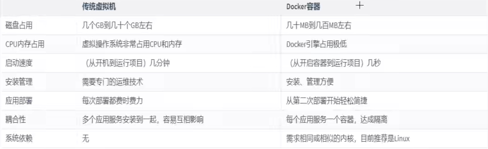
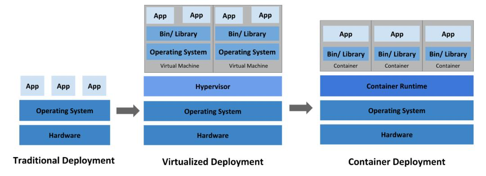
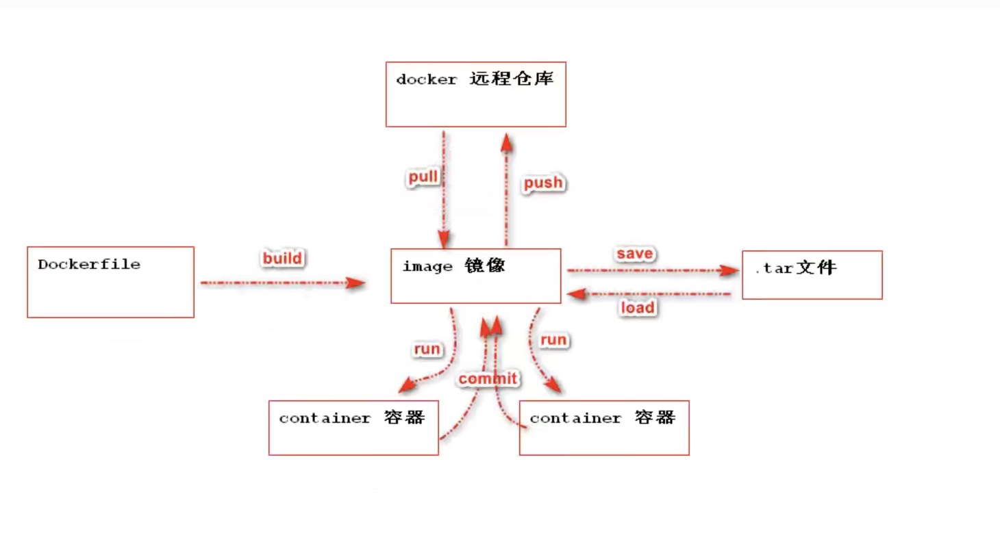
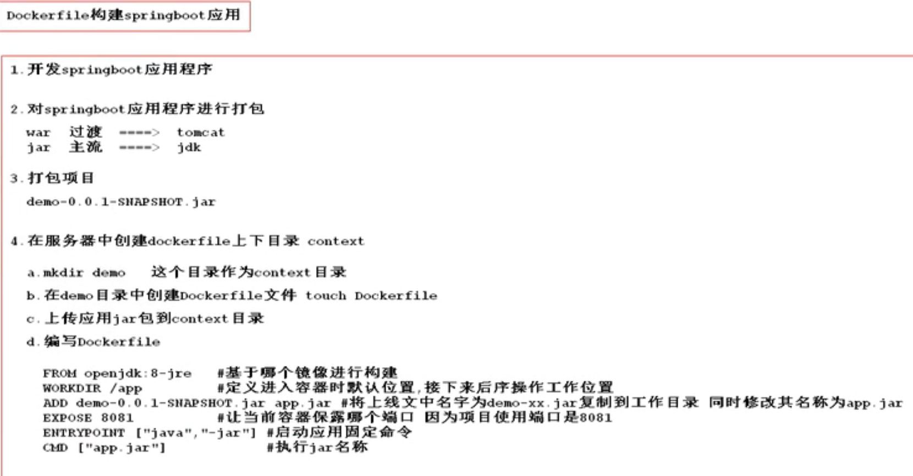
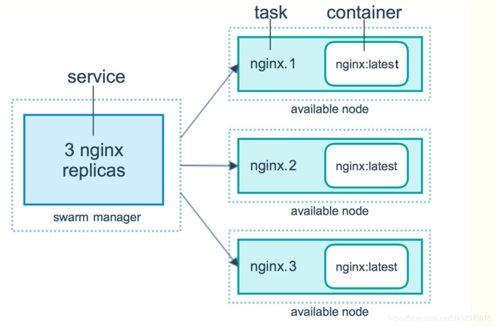

#知识管理/云计算

> [!NOTE] 什么是容器
>容器也是虚拟化，但是属于“轻量级”的虚拟化。它的目的和虚拟机一样，都是为了创造“隔离环境”。但是，它又和虚拟机有很大的不同——虚拟机是操作系统级别的资源隔离，而容器本质上是进程级的资源隔离，将OS上层的应用进行了隔离。开发者可以打包应用以及依赖包到一个可移植的镜像中，然后发布到任一Linux或Windows机器上，相互之间不会有任何接口，实现APP与操作系统的解耦。

> [!tip] 特点
> - 用户需要高效运行环境，而非整个机器
> - 一次构建，到处运行
> - 部署方便(创建速度快，秒级)
> - 隔离性好
> - 成本低 

## Docker

Docker是一个开源的应用容器引擎，让开发者可以打包他们的应用以及依赖包到一个可移植的容器中，然后发布到任何Linux或Windows机器上，容器是完全使用沙箱机制，相互之间不会有任何接口。

实现应用与运行环境整体打包以及打包格式统一。

Docker技术的三大核心概念，分别是：镜像(Image)、容器(Container)、仓库(Repository)

### 镜像(image)

定义：可执行的独立软件包，包括软件运行的内容：代码、运行时环境、系统工具、系统库和设置，如mysql镜像，nginx镜像
特点：只读

### 容器(container)

定义：开发者打包应用以及依赖包到一个可移植的镜像中，然后发布到任意Linux或者Windows机器上，实现App和操作系统的解耦.基于某个镜像启动一次就会生成一个程序实例，一个程序实例称之为容器或服务
特点：可读可写

### 仓库(repository)

定义：存储docker中所有的镜像具体位置

 - 远程仓库
 - 本地仓库

### 数据卷(volume)

定义：实现宿主机系统与容器之间文件共享
特点：对数据卷的修改会立即影响到对应容器的，对数据卷的修改不会影响镜像，数据卷会一直存在，即使容器被删除

### Docker三大用途：

1. 提供一次性环境，比如，本地测试软件、持续集成的时候提供单元测试和构建的环境。
2. 提供弹性的云服务。因为Docker容器可以随开随关，很适合动态扩展或缩容。
3. 组件微服务架构。通过多个容器，一台机器可以跑多个服务，因此在本机就可以模拟出微服务架构。

### Dockerfile

定义：用来帮助我们构建一个自定义的镜像，Dockerfile是镜像的构建文件，描述文件
核心：用户可以将自己的应用打包成镜像，这样就可以让自己的应用进行容器运行

### Docker Compose

定义：docker官方的开源项目，负责实现对docker容器集群的快速编排，定义和运行多个docker容器的应用，同时可对多个容器进行编排
核心：一个服务(service)对应一个容器，服务可以定义多个，项目(project)由一组关联的应用容器组成的一个完整的业务单元，在docker-compose.yml文件中定义

### Docker Swarm

Docker引擎内置(原生)的集群管理和编排工具。其主要作用是把若干台Docker主机抽象为一个整体，并且通过一个入口统一管理这些Docker主机上的各种Docker资源。Swarm和Kubernetes比较类似，但是更加轻量，具有的功能也较kubernetes更少一些。

#### 节点

运行Docker的主机可以主动初始化一个Swarm集群或者加入一个已存在的Swarm集群，这样这个运行Docker的主机就成为一个Swarm集群的节点(node)。

节点分为管理(manager)节点和工作(worker)节点。
管理节点用于Swarm集群的管理，docker swarm命令基本只能在管理节点执行(节点退出集群命令`docker swarm leave`可以在工作节点执行)。一个Swarm集群可以有多个管理节点，但只有一个管理节点可以成为leader，leader通过raft协议实现。

工作节点是任务执行节点，管理节点将服务(service)下发至工作节点执行。管理节点默认也作为工作节点。也可以通过配置让服务只运行在管理节点。

#### 服务和任务

 - 任务(`Task`)是`Swarm`中的最小的调度单位，目前来说就是一个单一的容器。
 - 服务(`Services`)是指一组任务的集合，服务定义了任务的属性。服务有两种模式：
	 - `replicated services`按照一定规则在各个工作节点上运行指定个数的任务。
	 - `global services`每个工作节点上运行一个任务

两种模式通过`docker service create`的`--mode`参数指定。

Swarm是典型的master-slave结构，通过发现服务来选举manager。manager是中心管理节点，各个node上运行agent接受manager的统一管理，集群会自动通过Raft协议分布式选举出manager节点，无需额外的发现服务支持，避免了单点的瓶颈问题，同时也内置了DNS的负载均衡和对外部负载均衡机制的集成支持。

 - N个Manager节点最多可以同时容忍(N−1)/2个 Manager节点失效的情况下保证高可用。
 - Docker建议最多最多的情况下，使用7个Manager节点就够了，否则反而会降低集群的性能了。
