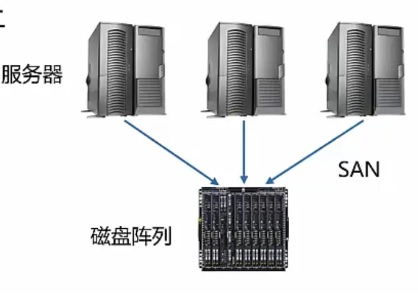

#知识管理/云计算

> [!NOTE] 什么是虚拟化
> 虚拟化是[云计算](云计算.md)的基础，虚拟化就是在一台物理服务器上，运行多台“虚拟服务器”，即通过该技术(将CPU、内存，存储等资源池化-资源池)将一台物理机虚拟为多台逻辑计算机，每个逻辑计算机可以运行不同的操作系统，并且应用程序都可以在相互独立的空间内运行而互不影响。这种虚拟服务器，也叫虚拟机(VM，Virtual Machine)，虚拟机共享物理服务器的CPU、内存、硬件、网卡等资源。

 - 物理机，通常称为“宿主机(Host)”。
 - 虚拟机，则称为“客户机(Guest、DomainU)”。
## Hypervisor

实现物理资源虚拟化，也叫做VMM(Virtual Machine Monitor，虚拟机监视器)。它不是一款具体的软件，而是一类软件的统称。

### Hypervisor分为两大类

1. Hypervisor直接运行在物理机之上。
2. 2.	虚拟机运行在Hypervisor之上。
像VMware、KVM、Xen、Virtual Box，都属于Hypervisor。

## 虚拟化的类型

### 裸金属虚拟化

 - 直接将VMM安装在硬件设备上，VMM在这种模式下又叫Hypervisor，虚拟机指令要执行时，Hypervisor会接管该指令，模拟相应操作。
 - 特点：
	 - 不依赖操作系统
	 - 支持多种操作系统，多种应用
	 - 依赖虚拟层内核和服务器控制台进行管理
	 - 需要对虚拟层的内核进行开发
	 - VMware ESX、Xen、华为FusionSphere

### 寄居虚拟化

 - 在主机（宿主机）操作系统上安装和运行虚拟化程序
 - 特点：
	 - 简单，易实现
	 - 两层OS，管理开销大，性能损耗大
	 - 虚拟机对各种物理设备(CPU、内存、硬盘等)的调用，都通过虚拟化层和宿主机的OS一起协调才能完成
 - Vmware Workstation和VirtualBox都是基于这种方式实现的

### 混合虚拟化

 - 在一个现有的正常操作系统下安装一个内核模块，内核拥有虚拟化能力(相当于裸金属和寄居的混合)。
 - 特点：
	 - 相对于寄居虚拟化架构，性能高
	 - 相对于裸金属虚拟化架构，不需要开发内核
	 - 可支持多种操作系统
	 - 需底层硬件支持虚拟化扩展功能
 - Redhat KVM

## 虚拟化的特点

- 分区
	- 一台服务器上运行多台虚拟机，使一台服务器运行多个应用程序
- 隔离
	- 分区完后的所有虚拟机之间相互隔离，每个虚拟机像单独的物理机
- 封装
	- 整个虚拟机运行条件封装在独立文件夹中，可通过移动文件夹的方式来迁移虚拟机
- 相对于硬件独立
	- 虚拟机运行在虚拟化层之上，不必考虑物理服务器即可在任何服务器上运行，即虚拟机上可以安装人任何操作系统，而硬件上安装需要考虑是否兼容的问题  

## 虚拟化层架构

### 全虚拟化

- 虚拟机具有完全的物理特性，虚拟化层负责捕获CPU指令，为指令访问硬件充当媒介
- 典型的有：VMware、Virtualbox、Virtual PC，KVM-x86
- 特点：
	- Guest OS无需修改
	- 速度和功能都非常不错，使用简单
	- 移植性好
	- 效率不高
- KVM（Kernel-Based Virtual Machines），基于Linux内核的虚拟化技术，可以直接将Linux内核转换为Hypervisor，从而使得Linux内核能直接管理虚拟机，直接调用Linux内核中的内存管理、进程管理子系统来管理虚拟机。
- 组成：由处于内核态的KVM模块和用户态的QEMU两部分组成。

### 半虚拟化

- 需要修改OS，Hypervisor直接安装在物理机上，多个虚拟机在Hypervisor上运行，Hypervisor实现方式一般是一个定制的Linux系统。
- 典型的有：Xen、VMware EXSi、微软Hyper-V。
- 特点：
	- 架构更精简
	- 在整体速度上有一定的优势
	- 需要对OS进行修改，在用户体验方面比较麻烦
- Xen：直接把操作系统内核改了，把OS改成一个轻量级Hypervisor在里面运行了一个管理所有资源作资源调度的Domain0。
- 组成：由Ken Hypervisor(虚拟化层)、Domain0(管理主机)、Domain U(用户虚拟机)

### 硬件辅助虚拟化

- 对硬件的改造来支持虚拟化技术。 常用于优化全虚拟化和半虚拟化产品，像VMware Workstation，它虽然属于全虚拟化，但它在6.0版本中引入了硬件辅助虚拟化技术，比如Inter的VT-x和AMD的AMD-v。主流虚拟化和半虚拟化产品都支持硬件辅助虚拟化。(VirualBox，KVM，Xen等)

1. Xen需要升级内核，维护一套内核，进来的数据包需要经过domain0来处理。
2. KVM更轻量化，通过内核模块来实现，一个VM就是一个进程。
3. Xen被Citrix收购，支持CloudStack。
4. KVM被红帽收购，支持OpenStack。

## 常见虚拟化架构

 - OpenStack Nova
 - 阿里云ECS
 - 腾讯云CVM 

## 企业级虚拟化

- Vmware Vsphere
- Microsoft Hyper-V
- Huawei FusionCompute
- 开源虚拟化KVM、XEN

## 计算虚拟化

### CPU虚拟化

在物理机(宿主机)中，通过线程或进程这种纯软件方式模拟出假的CPU。通过CPU虚拟化就可以将一个物理CPU发给不同的虚拟机使用，单物理CPU核数要大于虚拟CPU总核数，因为虚拟出来的每颗CPU实际上就是一个线程或进程。虚拟CPU过多时，需要进行进程/线程的切换，比较浪费。
总vCpus = 服务器CPU个数 * 核数kernel * 线程数(超线程为2，单线程为1)
一般多个虚拟机之间可以复用一个物理CPU，所以单台服务器上的虚拟机可以使用的vCpus大于总的vCpus数量。

#### CPU Qos

CPU Qos(Quality of Service)服务质量，用来控制虚拟机使用CPU资源量的大小，主要有三类：份额、预留、限额
1. CPU资源限额：控制虚拟机占用物理机资源的使用上限
2. CPU资源份额：定义了多台虚拟机在竞争物理机CPU资源时，需按比例分配计算资源。
3. CPU资源预留：定义了多台虚拟机在竞争物理机CPU资源时，每台虚拟机最低分配的计算资源。

#### NUMA

NUMA(Non Uniform Memory Access Architecture)非统一内存访问体系结构，提高物理服务器性能的一种技术。
原理：将物理服务器的CPU和内存资源分到多个node上，由于node内部可以独立工作。node内的内存访问效率最高，NUMA保证了一个VM上的vCpu尽量分配到同一个node中的物理CPU上，如果一台VM的vCpu跨node访问内存的话，访问的延时肯定增加。

### 内存虚拟化

内存虚拟化抽象了物理内存，虚拟机每个进程都被赋予了一块连续的、超大的(根据系统结构来定，32位系统寻址空间为232,64位系统寻址空间为264)虚拟内存空间，进程可以毫无顾忌的使用内存，不用担心申请内存会和别的进程冲突，因为底层有机制帮忙处理这种冲突，能够将虚拟地址根据一个页表映射成相应的物理地址。

#### 内存虚拟化类型

1. 全虚拟化：影子页表技术
2. 半虚拟化：页表写入法
3. 硬件辅助虚拟化：Inter扩展页表EPT(Extend Page Table)和AMD嵌入页表NPT(Nested Page Table)

- 全虚拟化中为每个VM维护一个影子页表(Shadow Page Table)，记录虚拟化内存与物理内存的映射关系，VMM将影子页表提交给CPU的内存管理单元MMU进行地址转换，VM的页表无需改动。
- 半虚拟化采用页表写入法，为每个VM创建一个页表并向虚拟化层注册。VM的运行过程中，VMM不断管理和维护该页表，确保VM能访问的到合适的地址。

#### 内存复用

- 内存复用是指在物理服务器内存一定的情况下，通过综合利用内存复用单项技术(内存气泡、内存共享、内存交换)对内存进行分时复用。通过内存复用，使得虚拟机内存规格总和大于服务器内存规格总和，提高服务器中虚拟机密度。
- 内存复用Qos有：内存预留(VM预留最低的物理内存)，内存份额(使用资源复用场景，按比例分配内存资源)。

##### 内存复用常用技术

- 内存气泡：虚拟化层将较空闲的VM内存，分配给内存使用较高的虚拟机。内存的分配和回收由虚拟化层实现，虚拟机上的应用无感知。提高物理内存利用率，但所有虚拟机使用的分配内存总量不能超过该服务器的物理内存总量。
- 内存交换：将外部存储虚拟成内存给VM使用，将VM上长时间未访问的数据存放到外部存储上，建立映射关系。VM再次访问这些数据是通过映射在内存上的数据进行交换。
- 内存共享：VM只对共用的内存(共享数据内容为零的内存页)做只读操作，有写操作时，运用写时复制(VM有写操作时，开辟另一空间，并修改映射)。

##### 内存复用优点

开启内存复用技术可以将物理内存复用比例提高150%，甚至更多。

### I/O虚拟化

I/O虚拟化的目标是保障VM的IO隔离与正常高效的执行。

#### I/O虚拟化类型

- 全虚拟化：通过软件模拟的形式模拟IO设备(性能不高)
- 半虚拟化：由Hypervisor提供资源调用接口，VM通过特定的接口与Hypervisor通信，完成获取完整I/O资源控制操作。(需修改内核及驱动程序，存在移植性和适用性问题，导致其使用受限)
- 硬件辅助虚拟化：就是I/O直通技术，通过硬件的辅助可以让虚拟机直接访问物理设备，而不需要通过VMM，最常用的就是SR-IOV(Single Root I/O Virtualizmion)单根I/O虚拟化标准，该技术可以直接虚拟出128-512网卡，可以让虚拟机都拿到一块独立的网卡，直接使用I/O资源。

#### I/O环

- 正常我们的I/O分为：密集I/O和非密集I/O
- 非密集I/O：在一秒钟读的次数很少
- 密集I/O：在一秒钟完成了多次读，但每次读取的内容是少量的。
- I/O环适配功能主要用来提升大块(44k以上)多队列(32队列深度以上)类型的I/O密集型业务的I/O性能(就是将存储设备的资源利用率提高)
- 用户可通过开启I/O环适配功能，提升I/O性能。

## 存储虚拟化

存储虚拟化就是把多个存储介质(如硬盘、[RAID](RAID.md))通过一定的技术将它们集中起来，组成一个存储池(Storage Pool)进行统一管理，从主机和工作站的角度，看到就不是多个硬盘，分区或者卷，就好像是一个超大容量(如1T以上)的硬盘。这种可以将多种、多个存储设备统一管理起来，为用户提供大容量、高数据传输性能的存储系统，就称之为虚拟存储。即将一个存储设备虚拟成多个存储设备，或者将多个存储设备虚拟成一个存储设备。

### 存储虚拟化的作用

- 提高硬件资源使用率
- 简化系统管理的复杂度
- 增强云存储平台的可靠性
1. 对管理员/服务提供商来说，可方便的调整存储资源，提高存储利用率
2. 对使用者来说，集中的存储设备可以提供更好的性能和方便性

### 云计算存储模型

- 存储资源
	- 表示实际的物理存储设备，例如DAS(直连存储)、NAS(网络附加存储)、SAN(存储区域网络)等。
- 存储设备
	- 表示存储资源中的管理单元，例如本地磁盘、LUN(逻辑单元号)、Storage存储池、NAS共享目录等。
- 数据存储
	- 表示虚拟化平台中可管理的存储逻辑单元，承载了虚拟机业务，创建磁盘。

### 使用虚拟存储流程

- 在主机软件界面添加存储资源(SAN、DAS等)，对主机的启动进行配置。
- 主机关联存储资源后，进行扫描存储设备(本地磁盘、LUN等)，将具体的设备扫描到主机上。
- 主机在选择存储设备，进行数据存储的添加，并进行虚拟化。
- 最后对虚拟化好的数据存储进行创建卷操作。

### 常见存储类型

1. 本地磁盘
	- 云计算虚拟化场景下的本地磁盘是指使用服务器本地的磁盘资源，经过[RAID](RAID.md)化后提供给虚拟化平台使用。
2. DAS
	- 直连式存储(Direct-Attached Storage，简称DAS)：是一个存储设备与使用存储空间的服务器直接相连的架构。DAS为服务器提供块级的存储服务。
3. NAS
	- 网络附加存储（Network Attached Storage），将分布、独立的数据进行整合，集中化管理，提供存储服务，可通过网络来访问存储里面的内容，最大的特点是存储空间共享，也就是网络访问，可以实现如数据同步，照片备份，重要资料备份等等，通常通过标准以太网连接到网络，以文件的形式访问数据，与视频和医学图像等非结构化数据相关联。
4. SAN
	- 存储区域网络（STORAGE AREA NETWORK），由互连的主机、交换机和存储设备组成即主机到存储之间的网络，独立于计算机局域网(LAN)。提供在主机和存储系统之间数据传输，网络内部数据传输的速率快，常见架构有：
		- IP-SAN：走以太网网口，即走IP网络 ISCSI 用VLAN隔离
		- FC-SAN：(Fibre Channel)走光纤通道

### 存储模式

1. 非虚拟化存储
	- 非虚拟化存储是传统的存储模式，就是把磁盘进行分区，分割成不同的逻辑卷，每一个逻辑卷可以给到虚拟机进行使用。
	- 特点：
		- 性能好(不再有中间的虚拟层，VM读写直接在磁盘上)、速度快、效率高。
		- 支持的存储功能少(不支持快照、精简配置等)
2. 虚拟化存储
	- 虚拟化存储是将不同的存储设备、磁盘进行格式化，格式化的目的是屏蔽底层存储设备的能力、接口协议等差异性，将各种存储资源转换为统一管理的数据存储资源。
	- 特点：
		- 支持多种存储功能(快照、精简配置、磁盘扩容、存储热迁移等)。
		- 性能不高(没有非虚拟化存储好)
3. 裸设备映射
	- 裸设备映射是将磁盘直接给到虚拟机使用，让虚拟机直接处理调用存储的命令(直接访问磁盘)中间虚拟化层不再对其进行任何干预(卷都不需要创建)
	- 特点：
		- 速度快(三种模式中最快)、性能好
		- 支持的存储功能少(不支持快照、精简配置等)，仅支持部分操作系统的虚拟机使用、数据存储只能整块当做裸设备映射的磁盘使用，不可分割。

### 存储虚拟化的实现

1. 基于主机的存储虚拟化
	- 若仅是单个主机服务器(或单个集群)访问多个磁盘阵列，可以使用基于主机的存储虚拟化技术。虚拟化的工作通过特定的软件在主机服务器上完成，经过虚拟化的存储空间可以跨越多个异构磁盘阵列。最大有点是其久经考验的稳定性，以及对异构存储系统的开放性。
	- 软件运行于主机上
	- 从与主机连接的存储上创建虚拟卷

2. 基于存储设备的虚拟化
	- 若是多个主机服务器需要访问同一个磁盘阵列的时候，可以采用基于存储设备。此时虚拟化的工作是在阵列控制器上完成，将一个阵列上的存储容量划分为多个存储空间(LUN)，供不同的主机系统访问。这种技术主要用在同一个存储设备内部，进行数据保护和数据迁移。它的优势是与主机无关，不占用主机资源，数据管理功能丰富。
	- 软件运行于存储设备中专门的嵌入式系统上
	- 从与SAN连接的存储上创建虚拟卷

3. 基于网络的存储虚拟化
	- 基于网络的存储虚拟化是通过在存储区域网络(SAN)中添加虚拟化引擎实现的。主要用于异构存储系统的整合和统一数据管理。优势是与主机无关，不占用主机资源，支持异构主机、异构存储设备，能使不同存储设备的数据管理功能统一，统一管理平台，可扩展性好。
	- 软件运行于存储网络中的磁盘阵列上
	- 从与磁盘阵列连接的存储上创建虚拟卷

### 存储虚拟化功能

1. 精简磁盘和空间回收
	- 精简磁盘和空间回收用于提高存储资源的使用效率、减小虚拟机未使用空间在主机上占用率过大的问题。
	- 特点：
		- 用户用多少分配多少(自动分配)
		- 空间回收可以将用户删除的数据空间释放到数据存储
2. 快照
	- 指定数据集合的一个完全可用拷贝，该拷贝包括相应数据在某个时间点(拷贝开始的时间点)的映像。快照可以是其所表示的数据的一个副本，也可以是数据的一个复制品。快照的作用主要是能够进行在线数据备份与恢复。
	- 特点：
		- 记录了虚拟机在某一个时间点的内容和状态
		- 恢复虚拟机快照可以使虚拟机多次快速恢复到某一个时间点
		- 快照包含磁盘内容、虚拟机配置信息、内存数据
		- 多次快照之间保存差量数据，节约存储空间
	- 创建快照时会生成一个新的差分卷，虚拟机会挂载这个差分卷作为磁盘文件。
	- 快照方式：
		- ROW写时重定向
		- COW写时拷贝
		- WA随机写
3. 快照链
	- 对虚拟机进行多次的快照操作，这些多次的快照操作形成快照链。
	- 虚拟机卷始终挂载在快照链的最末端。
4. 链接克隆
	- 将源卷和差分卷组合映射为一个链接克隆卷，给虚拟机使用。一个链接克隆需要和原始虚拟机共享同一虚拟机磁盘文件。采用共享磁盘文件缩短了创建克隆虚拟机的时间，同时还节省了物理磁盘空间。通过链接克隆，可以轻松的为不同的任务创建一个独立的虚拟机。
5. 虚拟机虚拟磁盘文件迁移
	- 将虚拟机的磁盘从一个数据存储迁移到另一个数据存储，可以将虚拟机的所有磁盘整体迁移，也可以单个磁盘分别迁移，虚拟机的快照可以一起迁移，虚拟机开启或者关闭时都可以迁移。

## 网络虚拟化

- 将物理网络虚拟出多个相互隔离的虚拟网络，从而使得不同用户之间使用独立的网络资源，提高网络资源利用率，实现弹性的网络。
- VLAN就是一种网络虚拟化，在原有网络基础上通过VLAN Tag划分出多个广域网
- 网络虚拟化保障我们创建出来的虚拟机可以正常通信、访问网络。
- 传统数据中心无法满足部署多台虚拟机，网络架构固定
- 云计算数据中心满足部署多台虚拟机，网络架构会随虚拟机的迁移改变，满足虚拟机的迁移。

### 网络虚拟化的目的

- 节省物理主机的网卡设备资源，并且可以提供应用的虚拟网络所需的L2-L7层网络服务。
- 网络虚拟化软件提供逻辑上的交换机和路由器(L2-L3)，逻辑负载均衡，逻辑防火墙(L4-L7)等，且可以以任何形式进行组装，从而为虚拟机提供一个完整的L2-L7层的虚拟网络拓扑。

### 物理网络包含的设备

- 路由器：工作在网络层，连接两个不同的网络
- 二层交换机：工作在数据链路层，转发数据
- 三层交换机：工作在网络层，结合了部分路由和交换机的功能
- 服务器网卡：提供通信服务

### 网络虚拟化特点

1. 与物理层解耦
	- 接管所有的网络服务、特性和应用的虚拟网络必要的配置，简化这些服务、配置，将它们映射给虚拟化层，使用服务的应用只需要和虚拟化层打交道。
2. 网络服务抽象化
	- 虚拟网络层可以提供逻辑接口、逻辑交换机和路由器等，并确保这些网络设备和服务的监控、Qos和安全。可以和任意安全策略自有组合成任意拓扑的虚拟网络。
3. 网络按需自动化
	- 通过API自动化部署，一个完整的、功能丰富的虚拟网络可以自由部署在底层物理设施上，通过网络虚拟化，每个应用的虚拟网络和安全拓扑拥有移植性。
4. 多租户网络安全隔离
	- 计算虚拟化使多种业务或不同租户资源共享同一个数据中心资源，但其同时需要为多租户提供安全隔离网络。

### 虚拟化网络架构

#### 网卡虚拟化

网卡虚拟化的方法有：
- 软件网卡虚拟化
	- 主要通过软件控制各个虚拟机共享同一块物理网卡实现。软件虚拟出来的网卡可以有单独的MAC地址、IP地址。
	- 所有虚拟机的虚拟网卡通过虚拟交换机以及物理网卡连接至物理交换机。虚拟交换机负责将虚拟机上的数据报文从物理网口转发出去。
- 硬件网卡虚拟化
	- 主要用到的技术是单根I/O虚拟化(Single Root I/O Virtulization，SR-IOV)，就是I/O直通技术，通过硬件的辅助可以让虚拟机直接访问物理设备，而不需要通过VMM。该技术可以直接虚拟出128-512网卡，可以让虚拟机都拿到一块独立的网卡，直接使用I/O资源。SR-IOV能够让网络传输绕过软件模拟层，直接分配到虚拟机，这样就降低了软件模拟层中的I/O开销。

#### 虚拟化软件交换机

- OVS(Open vSwitch)开发虚拟化软件交换机，是一款基于软件实现的开源虚拟以太网交换机，使用开源Apache2.0许可协议，主要用于虚拟机VM环境。
- 与众多开源的虚拟化平台相整合(支持Xen、KVM及VirtualBox多种虚拟化技术)，主要有两个作用：
	- 传递虚拟机之间的流量
	- 实现虚拟机和外界网络的通信

#### 虚拟化中的网络架构

- 虚拟化中的网络架构通常使用虚拟交换机来连接虚拟机与物理交换机，实现虚拟机之间的通信

#### 虚拟化中的关键网络资源

- 虚拟化中的关键网络资源大致可以分为：
	- 物理资源：物理服务器(提供物理网卡)、物理交换机(提供物理网络)
	- 虚拟资源：虚拟机(提供虚拟网卡)、虚拟交换机(提供虚拟交换端口(组)和上行链路)
- 虚拟交换机在虚拟化网络中起到承上启下的作用。

#### 虚拟化中数据的转发路径

- 相同端口组不同服务器内的虚拟机通讯需要经过物理网络。
- 相同端口组相同服务器内的虚拟机通讯不需要经过物理网络。
- 不同端口组相同服务器的虚拟机通讯需要经过物理网络。

### 虚拟网络

#### 链路虚拟化

1. 虚链路聚合
	- VPC(Virtual Port Channel)虚链路聚合，最常见的二层虚拟化技术。
	- 链路聚合将多个物理端口捆绑在一起，虚拟成为一个逻辑端口。但传统链路聚合不能跨设备，VPC很好解决了这个问题，既可以跨设备，又可以增加链路带宽、实现链路层的高可用。
2. 隧道协议
	- 隧道协议(Tunneling Protocol)：通过隧道协议使多个不同协议的网络实现互联。使用隧道传递的数据可以是不同协议的数据帧或包。隧道可以将数据流强制送到特定的地址，并隐藏中间节点的网络地址，还可以根据需要，提供对数据加密的功能。
	- 典型的隧道协议：
		- GRE(Generic Routing Encapsulation)通用路由封装。
		- IPsec(Internet Protocol Security)Internet协议安全。

#### 虚拟网络

- 虚拟网络(Virtual Network)：是由虚拟链路组成的网络。
- 虚拟网络节点之间的连接并不适用物理线缆连接，而是依靠特定的虚拟化链路相连。
- 典型的虚拟网络包括：
	- 层叠网络(虚拟二层延伸网络)。
	- VPN网络。

#### 层叠网络

- 层叠网络(Overlay Network)：在现有网络的基础上搭建另外一种网络。
- 层叠网络允许对没有IP地址标识的目的主机路由信息。
- 层叠网络可以充分利用现有资源，在不增加成本的前提下，提供更多的服务。(比如ADSL Internet接入线路就是基于已经存在的PSTN网络实现)

#### VXLAN

- VXLAN(Virtual eXtensible Local Area Network)虚拟扩展局域网：很好的解决了现有VLAN技术无法满足大二层网络需求的问题。
- VXLAN技术是一种大二层的虚拟网络技术。
- 原理是引入后一个UDP格式的外层隧道作为数据链路层，而原有数据报文内容作为隧道净荷加以传输。

#### 虚拟专用网

- VPN(Virtual Private Network)虚拟专用网：是一种常用于连接中、大型企业或团体与团体间的私人网络的通信方法。
- 通过公用的网络架构(比如互联网)来传送内联网的信息。
- 利用已加密的隧道协议来达到保密、终端认证、信息准确性等安全效果。这种技术可以在不安全的网络上传送可靠的、安全的信息。

存储厂商：

 - EMC
 - Netapp
 - Dell
 - IBM
 - HP
 - Huawei
 - 同友
 - 宏杉

光纤交换机：博科