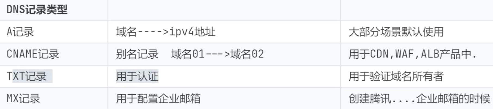

#知识管理/网络

## CDN
内容分发网络（Content Delivery Network），是建立并覆盖在承载网之上，由分布在不同区域的边缘节点服务器群组成的分布式网络，其目的是通过在现有的Internet中增加一层新的CACHE(缓存)层，将网站的内容发布到最接近用户的网络”边缘“的节点，使用户可以就近取得所需的内容，提高用户访问网站的响应速度。CDN 的工作原理就是将您源站的资源缓存到位于全球各地的 CDN 节点上，用户请求资源时，就近返回节点上缓存的资源，而不需要每个用户的请求都回您的源站获取，避免网络拥塞、缓解源站压力，保证用户访问资源的速度和体验。

## 网关
网关(Gateway)又称网间连接器、协议转换器。网关就是一个网络连接到另一个网络的“关口”，也就是网络关卡。网关在网络层以上实现网络互连，是复杂的网络互连设备，仅用于两个高层协议不同的网络互连。网关既可以用于广域网互连，也可以用于局域网互连。
网关设备可以是交互机、路由器、启用了路由协议的服务器、代理服务器、防火墙等。网关也是一个网络通向其他网络的IP地址。

## NAT
网络地址转换（Network Address Translation），允许一个整体机构以一个公用IP(Internet Protocol)地址出现在Internet上。顾名思义，它是一种把内部私有网络地址(IP地址)翻译成合法网络IP地址的技术。解决公用IP地址不足的问题，在NAT之内的电脑联机到因特网上面时，只显示主机公用IP，侦测不到终端机。
 - 静态转换Static Nat：内部每台电脑一对一转换成公有IP地址，是固定不变得。相当内部本地的每一台电脑都绑定了一个ip地址，即使这个地址没有被使用，其他的电脑也不能拿来转换使用。一般是用于在内网中对外提供服务的特定设备（如服务器）的访问。
 - 动态转换Dynamic Nat：是指内部每台电脑的IP地址转换为公有IP地址时，是动态的，不是固定的，随机分配。只要在这个IP资源池内，都可以随机使用。
 - 端口多路复用OverLoad：是指改变外出数据包的源端口并进行端口转换，采用端口多路复用方式。也就是说，内部电脑都可以使用一个合法的IP地址实现对因特网的访问，可以节省大量的IP资源。目前使用最多的就是这种方式。

## SNMP
SNMP位于两种网络模型的顶层即应用层，属于应用层协议，在传输层依靠UDP协议进行传输。SNMP(Simple Network Management Protocol)即简单网络管理协议，主要用在局域网中对设备进行管理，应用最为广泛的是对路由器交换机等网络设备的管理，当然不仅限于网络设备。SNMP分为管理端和代理端(agent)，管理端的默认端口为UDP 162，主要用来接收Agent的消息如TRAP告警消息;Agent端使用UDP 161端口接收管理端下发的消息如SET/GET指令等。

## BGP
BGP是边界网关协议Border Gateway Protocol的简称，是用来连接Internet上的独立系统的路由选择协议。BGP主要用于互联网AS（自治系统）之间的互联，BGP的最主要功能在于控制路由的传播和选择最好的路由。

## VLAN
虚拟局域网（Virtual Local Area Network），是一种通过局域网内的设备逻辑地址划分成一个一个网段从而实现虚拟工作组的新技术（隔离技术-隔离故障，例如病毒）。通过划分不同的VLAN，相同VLAN内的主机可以直接通信，不同VLAN之间的主机不能直接通信，从而将广播域限制在一个VLAN内。 
- 访问链接(Access Link)
	- 指的是“只属于一个VLAN，且仅向该VLAN转发数据帧”的端口。在大多数情况下，访问链接所连的是客户机。
- 汇聚链接(Trunk Link)
	- 指的是能够转发多个不同VLAN的通信的端口。汇聚链路上流通的数据帧，都被附加了用于识别分属于哪个VLAN的特殊信息。

## VPC
虚拟专有网络（Virtual Private Cloud），虚拟局域网，自定义网段，VPC网络相当于一个大的网段（局域网），还可以通过创建虚拟交换机划分子网。
配置建议：一个地区配置一个VPC
- 不同的VPC之间内网是不通的
- 同一个VPC中的不同交换机（可用区）内网是通的

## EIP
弹性公网IP（Elastic IP Address），是可以独立购买和持有的公网IP地址资源，当EIP和云资源绑定后，云资源可以通过EIP与公网通信。

## DNS
域名系统（Domain Name System），云解析DNS-万网（阿里云），DNSPOD（腾讯云），是互联网的一项服务。它作为将域名和IP地址相互映射的一个分布式数据库，能够使人更方便地访问互联网。DNS使用TCP和UDP端口53。DNS服务器有着相当全的域名和IP，当你输入一串网站的时候，这串网站并不会直接访问，而是先将这个网站发送给DNS服务器，DNS服务器帮你把这串网站变成了IP地址，然后返回给你的电脑，你再访问这个IP地址。
### DNS记录
由DNS构建起的域名与IP地址之间的对应关系称之为“DNS记录”（record）。通过设置不同的解析记录，可以实现对主机名不同的解析效果，从而满足不同场景下的域名解析需求。

1. A记录
	A（Address）记录是用来指定主机名（或域名）对应的IP地址记录。用户可以将该域名下的网站服务器指向到自己的web server上，同时也可以设置域名的子域名。简单来讲，A记录就是指定域名对应的IP地址。如我们添加一条A记录将www的主机指向IP192.168.1.1，那么当你访问www主机时就会解析到192.168.1.1这个IP上。
2. CNAM记录
	通常称别名解析，是主机名到主机名的映射。当需要将域名指向另一个域名，再由另一个域名提供 IP 地址，就需要添加 CNAME 记录，最常用到 CNAME的场景包括做CDN、企业邮箱、全局流量管理等。与A记录不同的是，CNAME别名记录设置的值不是一个固定的IP，而是主机的别名地址。
	别名解析可以提供更大的灵活性，便于统一管理。比如，当主机因某种因素的影响需要更换IP时，如果域名做了CNAME记录，就可以同时更新别名的解析指向，不需要进行新的解析操作。
3. TXT记录
	一般指某个主机名或域名的标识和说明。如：admin IN TXT "管理员, 电话：XXXXXXXXXXX"，mail IN TXT "邮件主机，存放在xxx , 管理人：AAA"，Jim IN TXT "contact: abc@mailserver.com"，也就是说，通过设置TXT记录内容可以使别人更方便地联系到你。TXT 记录常用的方式还有做 SPF 记录（反垃圾邮件）和SSL证书的DNS验证等。
4. MX记录
	MX（Mail Exchanger）记录是邮件交换记录，主要用于邮箱解析，在邮件系统发送邮件时根据收信人的地址后缀进行邮件服务器的定位。MX记录允许设置一个优先级，当多个邮件服务器可用时，会根据该值决定投递邮件的服务器。
	MX记录的权重对 Mail 服务非常重要，当发送邮件时，Mail 服务器先对域名进行解析，查找 MX记录。先找权重数最小的服务器（比如说是 10），如果能连通，那么就将服务器发送过去；如果无法连通 MX 记录为 10 的服务器，才将邮件发送到权重更高的 mail 服务器上。

## ARP
地址解析协议（Address Resolution Protocol），是根据IP地址获取物理地址（mac地址）的一个TCP/IP协议。

## WAF
Web应用防护系统（Web Application Firewall），Web应用防火墙是通过执行一系列针对HTTP/HTTPS的安全策略来专门为Web应用提供保护的一款产品。