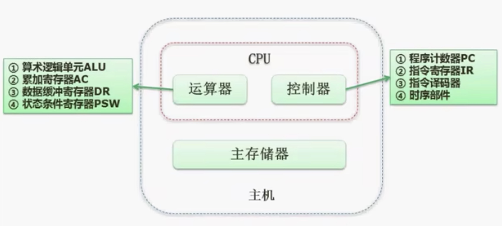
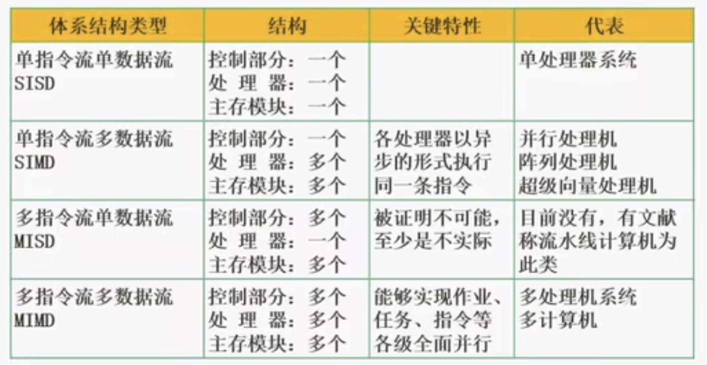
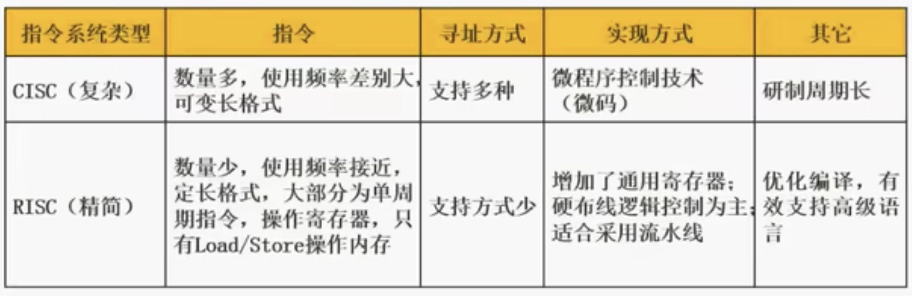
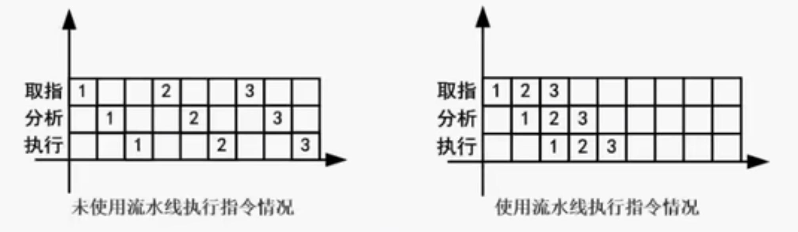
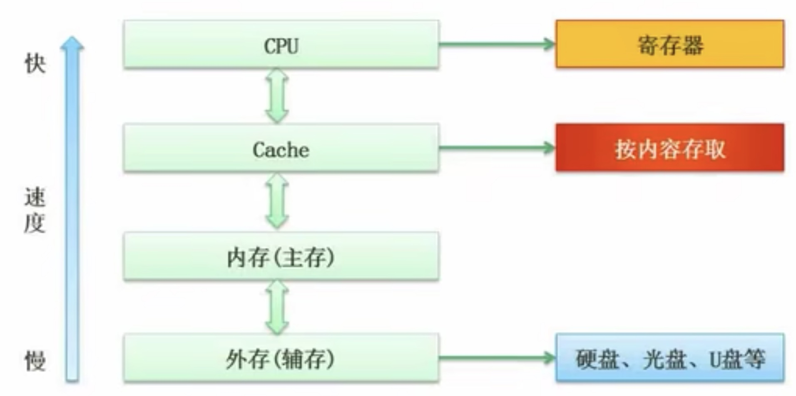

## 1.1 进制的转换
- R进制转十进制使用按权展开法
- 十进制转R进制使用短除法
- 每三个二进制位，可对应一个八进制位
- 每四个二进制位，可对应一个十六进制位
## 1.2 编码
### 1.2.1 原码：
1. 一个数转换成二进制的表达形式
2. 不足八位，高位补0
3. 最高位为符号位，正数为0，负数为1
### 1.2.2 反码：
- 正数：与原码相同
- 负数：根据原码，符号位以外，按位取反
### 1.2.3  补码：
- 正数：与原码、反码相同
- 负数：在反码的基础上，加1
### 1.2.4 移码：
- 用来做浮点运算中的阶码
- 在补码的基础上，符号位取反
|      |   数值1   |  数值-1   |    1-1    |
|:----:|:---------:|:---------:|:---------:|
| 原码 | 0000 0001 | 1000 0001 | 1000 0010 |
| 反码 | 0000 0001 | 1111 1110 | 1111 1111 |
| 补码 | 0000 0001 | 1111 1111 | 0000 0000 |
| 移码 | 1000 0001 | 0111 1111 | 1000 0000 |
### 1.2.5 数值表示范围：
|      |                     整数                     |
|:----:|:--------------------------------------------:|
| 原码 | -(2n-1 - 1) ~ 2n-1 - 1 |
| 反码 | -(2n-1 - 1) ~ 2n-1 - 1 |
| 补码 |    -2n-1 ~ 2n-1 - 1    |
其中，n表示数位
## 1.3 浮点数运算
浮点数表示：
N = M * Re
其中M成为尾数，e是指数，R为基数
对阶=>尾数计算=>结果格式化
对阶：低阶转为为高阶
结果格式化：小数点左边只能是一位，且不能为0
## 1.4 主机的基本构成

## 1.5 Flynn分类法

## 1.6 CISC与RISC

## 1.7 流水线
### 1.7.1 基本概念
流水线是指在程序执行时，多条指令重叠进行操作的一种准并行处理实现技术。各种部件同时处理是针对不同指令而言的，它们可同时为多条指令的不同部分进行工作，以提高各部件的利用率和指令的平均执行速度。
->取指->分析->执行->

### 1.7.2 流水线计算
✅流水线周期为执行时间最长的一段（耗时最长的一个步骤）
✅流水线计算公式：
一条指令执行时间 + (指令条数 - 1) * 流水线周期
1. 理论公式：$$(t_1 + t_2 + ... + t_k) + (n - 1) \times \Delta t$$
2. 实践公式：$$(k + n - 1) \times \Delta t$$
△t:流水线周期
### 1.7.3 流水线吞吐率计算
流水线的吞吐率(Though Put rate, TP)是指在单位时间内流水线所完成的任务数量或输出的结果数量。计算流水线吞吐率的最基本公式如下：
$$TP = \frac{指令条数}{流水线执行时间}$$
流水线最大吞吐率：
$$TP_{max} = \underset{n\rightarrow\infty}{Lim} \frac{n}{(k + n - 1)\Delta t} = \frac{1}{\Delta t}$$
△t:流水线周期
### 1.7.4 流水线的加速比
完成同样的一批任务，不使用流水线所用的时间与使用流水线所用的时间之比成为流水线的速度比。计算流水线加速比的基本公式如下：
$$S = \frac{不使用流水线执行时间}{使用流水线执行时间}$$
### 1.7.5 流水线的效率
流水线的效率是指流水线的设备利用率。在时空图上，流水线的效率定义为n个任务占用的时空区与k个流水段总的时空区之比，计算公式如下：
$$E = \frac{n个任务占用的时空区}{k个流水段总的时空区} = \frac{T_0}{kT_k}$$
## 1.8 层次化存储结构

### 1.8.1 Cache
✅Cache的功能：提高CPU数据输入输出的速率，突破冯·诺依曼瓶颈，即CPU与存储系统间数据传送带宽限制。
✅在计算机的存储系统体系中，Cache是访问速度最快的层次。
✅使用Cache改善系统性能的依据是程序的局部性原则。
如果以h代表对Cache的访问命中率，t1表示Cache的周期时间，t2表示主存储器周期时间，以du操作为例，使用“Cache + 主存储器”的系统的平均周期为t3，则：
$$t_3 = h \times t_1 + (1 - h) \times t_2$$
其中，(1 - h)又称为失效率(未命中率)。
### 1.8.2 局部性原理
✅时间局部性
✅空间局部性
✅工作集理论：工作集是进程运行时被频繁访问的页面集合
### 1.8.3 主存分类
✅随机存取存储器
- DRAM(Dynamic RAM，动态RAM) - SDRAM
- SRAM(Static RAM，静态RAM)
✅只读存储器
- MROM(Mask ROM，掩模式ROM)
- PROM(Programmable ROM，一次可编程ROM)
- EPROM(Erasable PROM，可擦除的PROM)
- 闪速存储器(flash memory，闪存)
### 1.8.4 磁盘结构与参数
存取时间 = 寻道时间 + 等待时间(平均定位时间 + 转动延迟)
注意：寻道时间是指磁头移动到磁道所需的时间；等待时间为等待读写的扇区转到磁头下方所用的时间。
### 1.8.5 总线
根据总线所处位置不同，总线通常被分成三种类型，分别是：
- 内部总线
- 系统总线
	- 数据总线
	- 地址总线
	- 控制总线
- 外部总线
### 1.8.6 系统可靠性分析(可靠度与失效率)
- 串联系统
$$R = R_1 \times R_2 \times ... \times R_n $$
- 并联系统
$$R = 1 - (1 - R_1) \times (1 - R_2 ) \times ... \times (1 - R_n)$$
## 1.9 校验码
码距：一个编码系统的码距是整个编码系统中任意(所有)两个码字的最小距离。
码距与检错、纠错的关系：
1. 在一个码组内为了检测e个误码，要求最小码距d应该满足：d >= e + 1
2. 在一个码组内为了纠正t个误码，要求最小码距d应该满足：d >= 2t + 1
### 1.9.1 循环校验码CRC
✅可做检错不能纠错
模2除法是指在做除法运算的过程中不计其进位的除法(位运算方式为异或)。
### 1.9.2 海明校验码
✅可做检错也可纠错
