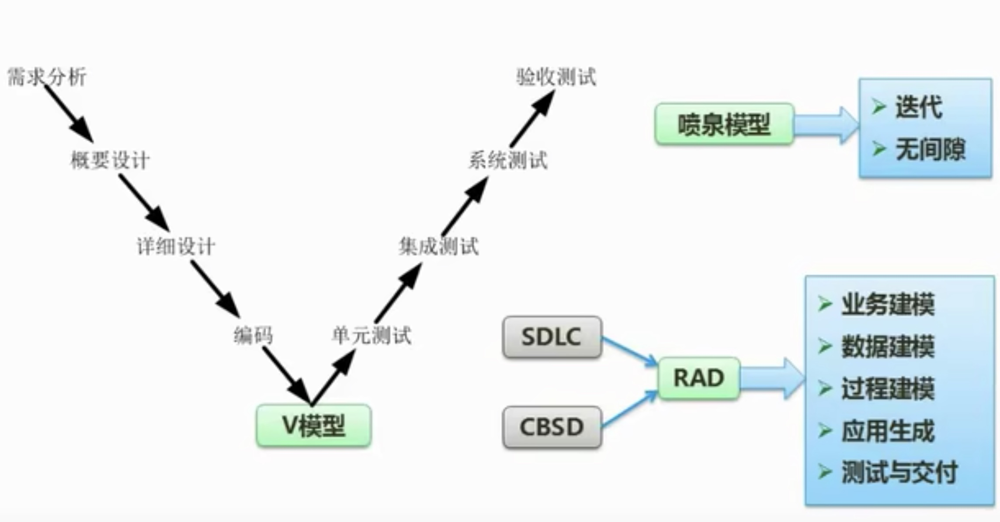
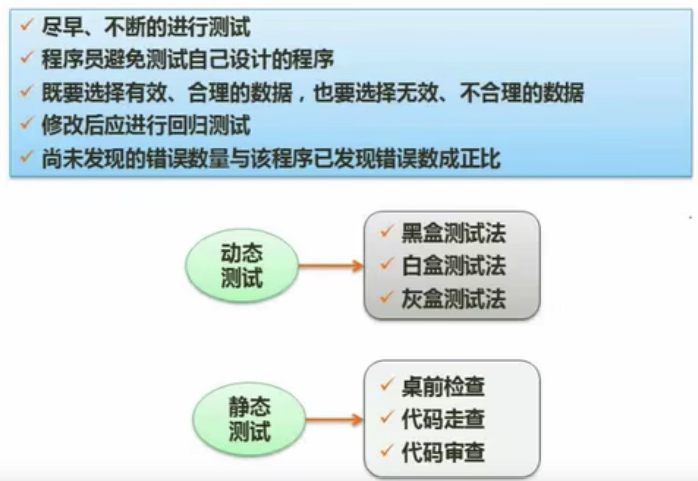
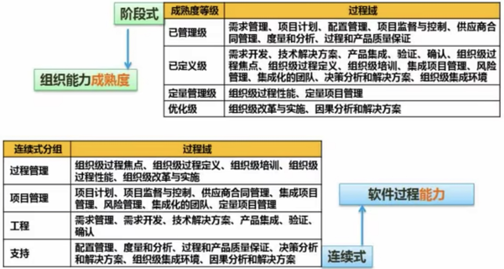

## 10.1 瀑布模型(SDLC)

定义阶段：软件计划、需求分析
开发阶段：软件设计、程序编码、软件测试
维护阶段：运行维护

## 10.2 其他经典模型

## 10.3 螺旋模型

## 10.4 V模型、喷泉模型和RAD

## 10.5 构建组装模型(CBSD)

## 10.6 统一过程

## 10.7 敏捷开发方法

## 10.8 信息系统开发方法

## 10.9 需求的分类

## 10.10 结构化设计
### 10.10.1 基本原则

### 10.10.2 内聚与耦合

## 10.11 测试原则与类型

## 10.12 测试用例设计

## 10.13 测试阶段

## 10.14 McCabe复杂度计算

## 10.15 系统运行于维护
>[!note]
>软件维护是生命周期的一个完整部分。可以将软件维护定义为需要提供软件支持的全部活动，这些活动包括在交付前完成的活动，以及交付后完成的活动。交付前完成的活动包括交付后运行的计划和维护计划等；交付后的活动包括软件修改、培训、帮助资料等

>[!check] 可维护性
> - 易分析性
> - 易改变性
> - 稳定性
> - 易测试性

>[!check] 维护类型
> - 改正性维护(25%)
> - 适应性维护(20%)
> - 完善性维护(50%)
> - 预防性维护(5%)

## 10.16 软件能力成熟度模型集成(CMMI)

## 10.17 项目管理基础知识
>[!info] 九大知识领域
> - 范围管理
> - 时间管理
> - 成本管理
> - 质量管理
> - 人力资源管理
> - 沟通管理
> - 风险管理
> - 采购管理
> - 整体管理

