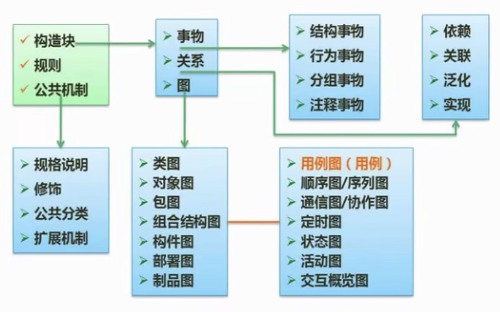
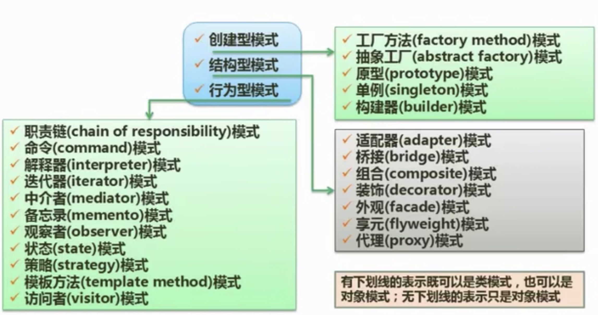
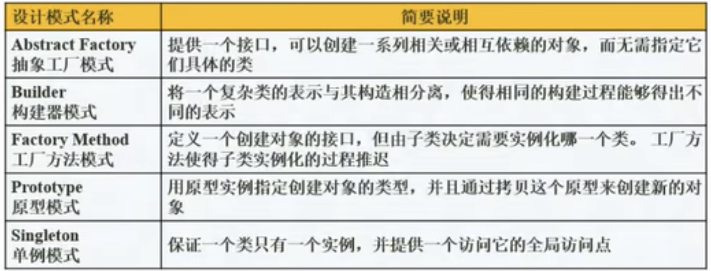
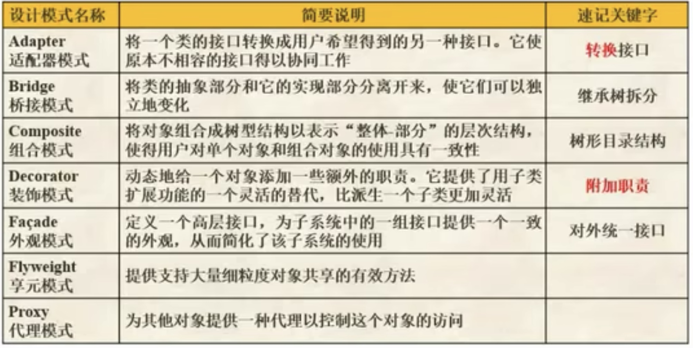
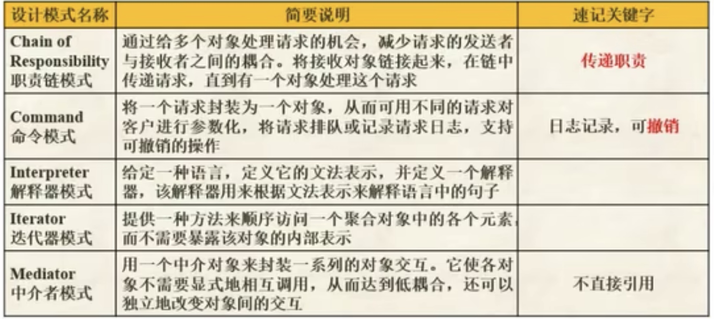
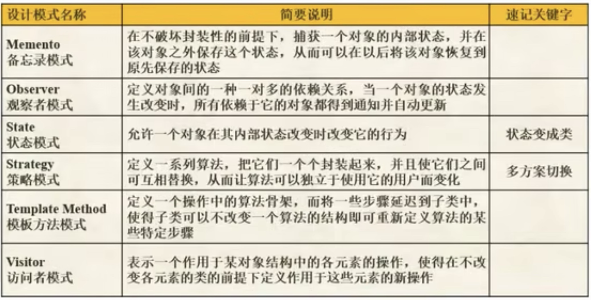

## 11.1 面向对象基本概念
>[!note] 基本概念
> - 对象
> - 类(实体类、边界类、控制类)
> - 抽象
> - 封装
> - 继承与泛化
> - 多态
> - 接口
> - 消息
> - 组件
> - 模式和复用

## 11.2 面向对象设计(设计原则)
>[!设计原则]
> - 单一职责原则：设计目的单一的类
> - 开放-封闭原则：对扩展开放，对修改封闭
> - 李氏(Liskov)替换原则：子类可以替换父类
> - 依赖倒置原则：要依赖于抽象，而不是具体实现；针对接口编程，不要针对实现编程
> - 接口隔离原则：使用多个专门的接口比使用单一的总接口要好
> - 组合重用原则：要尽量使用组合，而不是继承关系达到重用的目的
> - 迪米特(Demeter)原则(最少知识法则)：一个对象应当对其他对象有尽可能少的了解

## 11.3 UML

## 11.4 面向对象设计的设计模式
>[!note] 架构模式
>软件设计中的高层决策，例如C/S结构就属于架构模式，架构模式反映了开发软件系统过程中所作的基本设计决策

>[!note] 设计模式
>主要关注软件系统的设计，与具体的实现语言无关

>[!note] 惯用法
>最低层的模式，关注软件系统的设计与实现，实现时通过某种特定的程序设计语言来描述构件与构件之间的关系。每种编程语言都有它自己特定的模式，即语言的惯用法，例如引用-计数就是C++语言中的一种惯用法

## 11.5 设计模式的分类

### 11.5.1 创建型模式

### 11.5.2 结构型模式

### 11.5.3 行为型模式

