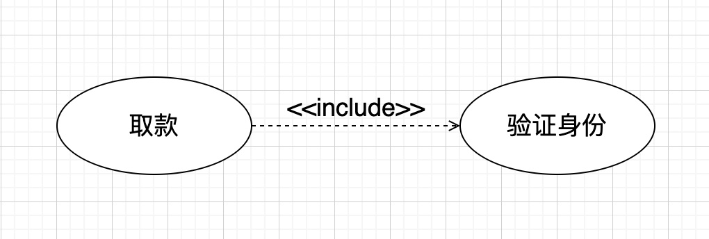
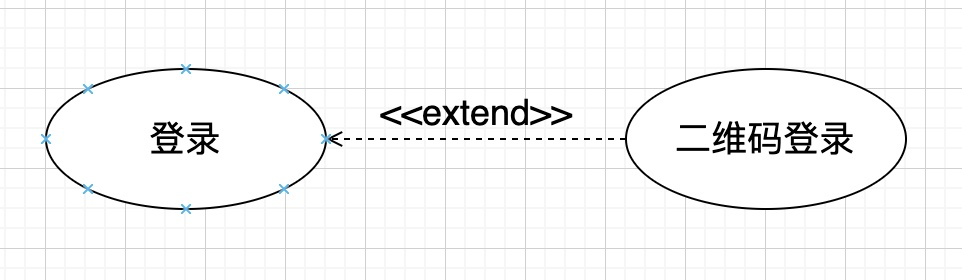
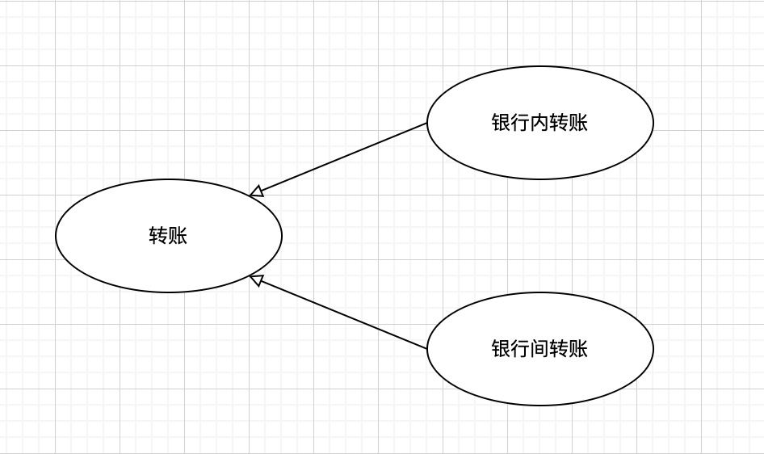
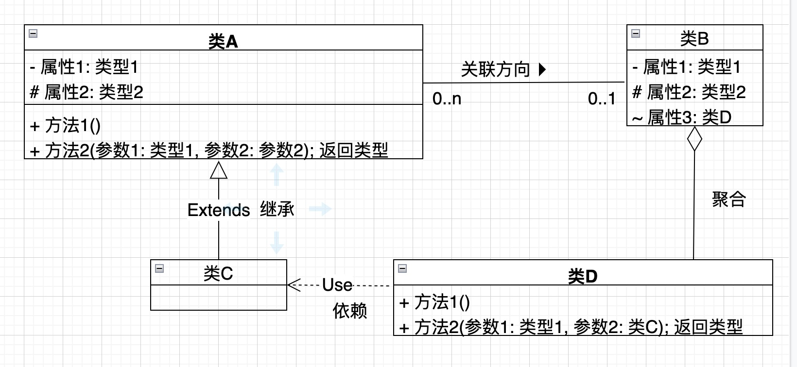
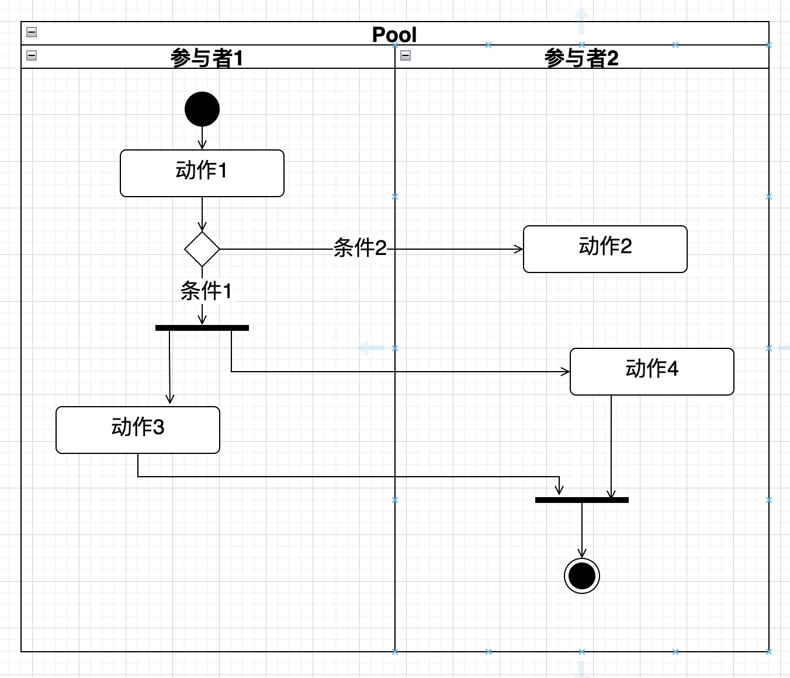

## 14.1 用例图
>[!note] 概念
>- 站在用户的角度，描述用户对系统的需求
>- 在系统开发的初期阶段，把握用户需求时使用，便于用户和系统开发者之间的意向沟通
>- 从动态的侧面来描述系统给用户可使用的功能
>- 在分析设计阶段，以用例图为基础，来做其他UML图像(如顺序图、通信图、类图)

>[!tip] 组成元素
>- 参与者(actor)
>- 用例(usecase)
>- 关系
>- 系统边界

>[!note] 包含(include)
>表示A需要用到B，需要把B给用进去（一般是把公共部分提取出来），用A------------>B表示（缺少了B，则A则不完整），提取公共交互，提高复用。
>

>[!note ] 扩展(extend)
>表示A的功能可以再扩展，可以用B来补充，用B---------->A表示（缺少了B，A仍然完整），“冻结”基用例以保持稳定，并且动态扩展基用例功能。
>

>[!note] 泛化(generalization)
>表示所谓的继承关系，比如A是子类，B是父类，同一业务目的的不同实现.
>

## 14.2 类图
>[!note] 概念
> - 类是着眼于现实中存在的事物(对象)的属性和行为的共同特征，并抽象后得到的
> - 类图是用来描述系统的静态结构和系统中类之间的静态关系
> - 一个系统中，可以从不同侧面做出多个不同的类图，一个类图是描述系统静态结构的某个侧面的视图(view)
> - 替代ER图(实体关系图)，因为ER图只能表达对象、属性，无法表达操作

>[!tip] 组成元素
> - 类(类名、属性、操作)
> - 关系(关联、泛化、依赖、实现)

>[!note] 关系
> - 泛化（generalization）关系时指一个类（子类、子接口）继承另外一个类（称为父类、父接口）的功能，并可以增加它自己新功能的能力，继承是类与类或者接口与接口最常见的关系
> - 实现（realization）是指一个class实现interface接口（一个或者多个），表示类具备了某种能力，实现是类与接口中最常见的关系
> - 依赖（dependency）关系也是表示类与类之间的连接，表示一个类依赖于另外一个类的定义，依赖关系时是单向的
> 	- 类A使用到了类B，这种依赖具有偶然性、临时性，是非常弱的关系。但是类B的变化会影响到类A
> 	- 人要过河，则人与船的关系就是依赖，人过河之后，与船的关系就解除了，因此是一种弱的连接
> - 关联（association）关系表示类与类之间的连接，它使得一个类知道另外一个类的属性和方法
> 	- 关联关系体现的是两个类，或者类与接口之间的强依赖关系，这种关系很强烈，比依赖更强，不是偶然性的，也不是临时性的，而是一种长期性，相对平等的关系
> 	- 关联可以使用单箭头表示单向关联，使用双箭头或者不适用箭头表示双向关联，不建议使用双向关联，关联有两个端点，每个端点可以有一个基数，表示这个关联的类可以有几个实例
> 	- 0..1 表示可以有0个或者1个实例
> 	- 0..* 表示对实例的数目没有限制
> 	- 1    表示只能有一个实例
> 	- 1..* 表示至少有一个实例
> - 聚合（aggregation）是关联关系的特例，是强的关联关系，聚合是整个与个体的关系，即has-a关系，整体和部分是可以分离的，他们具有各自的生命周期，部分可以属于多个对象，也可以被多个对象共享
> - 组合（compostion）也是关联关系的一种特例，体现的是一种contain-a关系，比聚合更强，是一种强聚合关系。
> 	- 同样体现整体与部分的关系，但此时整体与部分是不可分的，整体生命周期的结束也意味着部分生命周期的结束，反之亦然
> 	- 组合与聚合几乎完全相同，唯一区别就是对于组合，“部分”不能脱离“整体”单独存在，其生命周期应该是一致的。

>[!note] 可见性
> - \+ (public)
> - \- (private)
> - \# (protected)
> - \~ (包内可见)

## 14.3 顺序图
## 14.4 活动图
>[!note] 概念
>活动图用来描述系统或某个业务的处理流程
> - 业务相关工作流的描述
> - 用例的事件流的描述
> - 程序算法的描述

>[!tip] 组成元素
> - 活动：相当于构成业务和处理的一个单元，用圆角矩形来表示
> - 控制流：用箭头表示，连接两个活动，表示活动的先后顺序
> - 开始节点：用实心圆圈表示一个流程的开始
> - 终了节点：用实心圆圈外加一个圆圈来表示一个流程的结束
> - 判断节点和监护条件
> 	- 判断节点用菱形框来表示，根据判断结果的不同，处理流向不同的分支
> 	- 监护条件用来表示处理分支的条件
> - 分支节点：表示一个处理流程分割为多个并发流程
> - 汇合节点：表示对多个并发子流程进行同步
> - 参与者：也可以表示成泳道的形式

## 14.5 状态图
## 14.6 通信图