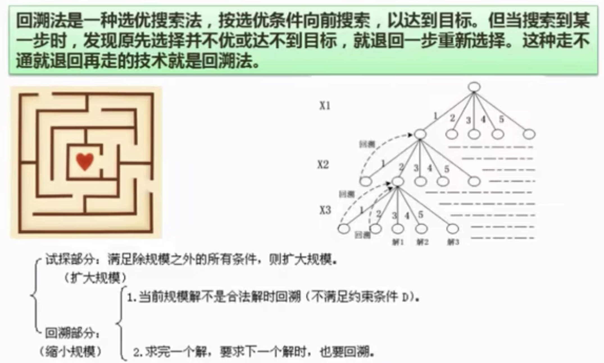

## 15.1 分治法
>[!note]
>对于一个规模为n的问题，若该问题可以容易的解决(比如说国模n较小)则直接解决；否则将其分解为k个规模较小的子问题，这些问题互相独立且与原问题形式相同，递归的解决这些问题，然后将各子问题的解合并得到原问题的解。

>[!tip]
> - 该问题的规模缩小到一定的程度就可以容易的解决
> - 该问题可以分解为若干个规模较小的相同问题
> - 利用该问题分解出的子问题的解可以合并为该问题的解
> - 该问题所分解出的各个子问题是相互独立的
>[!check]
> - 分解
> - 解决
> - 合并

### 15.1.1 递归技术
递归就是在运行的过程中调用自己
```Java
int F(int n)
{
	if(n==0) return 1;
	if(n==1) return 1;
	if(n>1) return F(n-1)+F(n-1)
}
```

### 15.1.2 二分查找
## 15.2 回溯法

## 15.3 贪心法
>[!note]
>总是做出在当前来说是最好的选择，而并不从整体上加以考虑，它所做的每步选择只是当前步骤的局部最优选择，但从整体来说不一定是最优的选择。由于它不必为了寻找最优解而穷尽所有可能解，因此其耗费时间少，一般可以快速得到满意的解，但得不到最优解。

## 15.4 动态规划法
>[!note] 
>在求解问题中，对于每一步决策，列出各种可能的局部解，再一句某种判定条件，舍弃那些肯定不能得到最优解的局部解，在每一步都经过筛选，以每一步都是最优解来保证全局是最优解。
