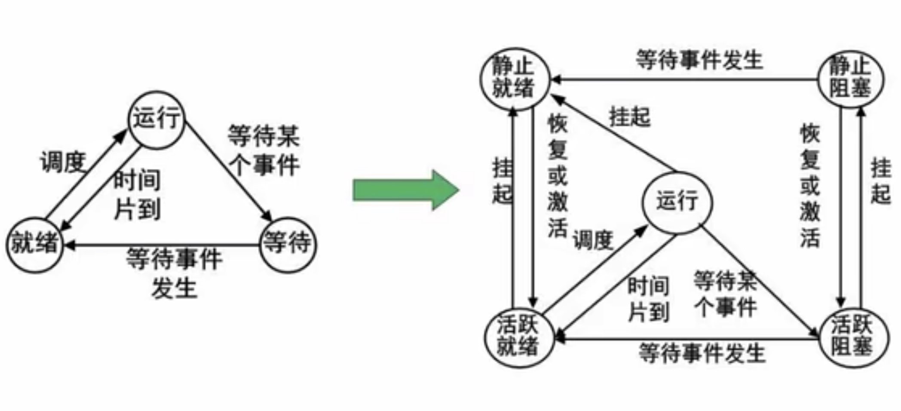
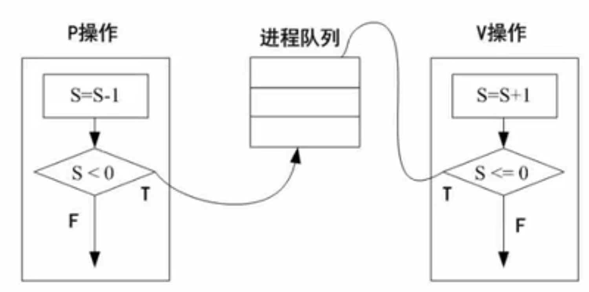
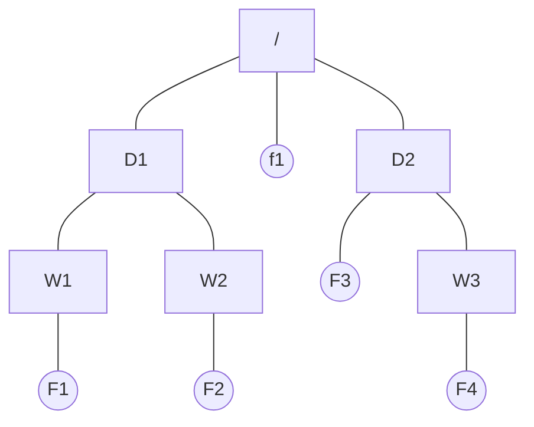
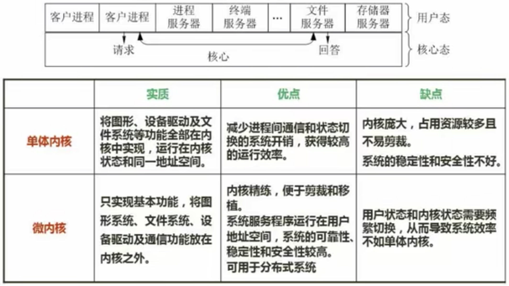

## 2.1 概述
✅管理系统的硬件、软件、数据资源
✅控制程序的运行
✅人机之间的接口
✅应用软件与硬件之间的接口
## 2.2 进程管理
### 2.2.1 进程的状态

### 2.2.2 前趋图
用于描述进程之间的执行顺序的一种有向无循环图。
结点表示： 一个进程、一个程序段或 一条语句。  
有向边表示： 前驱关系。箭头所指的是后继。
### 2.2.3 进程的同步与互斥
生产者消费者问题
### 2.2.4 PV操作
✅临界资源：诸进程间需要互斥方式对其进行共享的资源，如打印机、磁带机等。
✅临界区：每个进程中访问临界资源的那段代码成为临界区。
✅信号量：是一种特殊的变量。

### 2.2.5 死锁问题
进程管理是操作系统的核心，但如果设计不当，就会出现死锁问题。如果一个进程在等待一件不可能发生的事情，则进程就死锁了。而如果一个或多个进程产生死锁，就会造成系统死锁。
不发生死锁需要的最少资源数：$$k \times (n - 1) + 1$$
k:总的进程数
n:每个进程需要的资源数
### 2.2.6 银行家算法
银行家算法：分配资源的原子
✅当一个进程对资源的最大需求量不超过系统中的资源数时可以接纳该进程
✅进程可以分期请求资源，但请求的总数不能超过最大需求量
✅当系统现有的资源不能满足进程尚需资源数时，对进程的请求可以推迟分配，但总能使进程在有限的时间里得到资源
## 2.3 存储管理
### 2.3.1 页式存储
优点：利用率高，碎片小，分配及管理简单
缺点：增加了系统开销，可能产生抖动现象
### 2.3.2 段式存储
优点：多道程序共享内存，各段程序修改互不影响
缺点：内存利用率低，内存碎片浪费
### 2.3.3 段页式存储
优点：空间浪费小、存储共享荣耀、存储保护容易、能动态连接
缺点：由于管理软件的增加，复杂性和开销也随之增加，需要的硬件以及占用的内容也有所增加，使得执行速度大大下降
### 2.3.4 页面置换算法
✅最优(Optimal，OPT)算法
✅随机(RAND)算法
✅先进先出(FIFO)算法：有可能产生“抖动”。
✅最近最少使用(LRU)算法：不会“抖动”
## 2.4 文件管理
### 2.4.1 索引文件结构
### 2.4.2 树型目录结构
文件树形：
✅R 只读文件树形
✅A 存档树形
✅S 系统文件
✅H 隐藏文件

文件名的组成：
✅驱动器号
✅路径
✅主文件名
✅扩展名

✅绝对路径：是从盘符开始的路径
✅相对路径：是从当前路径开始的路径

✅若当前目录为：D1，要求F2路径，则：绝对路径：/D1/W2/F2，相对路径：W2/F2
### 2.4.3 空闲存储空间管理
✅空闲区表法(空闲文件目录)
✅空闲链表法
✅位示图法
✅成组链接法
## 2.5 设备管理
### 2.5.1 数据传输控制方式
### 2.5.2 虚设备与SPOOLING技术
## 2.6 微内核操作系统

