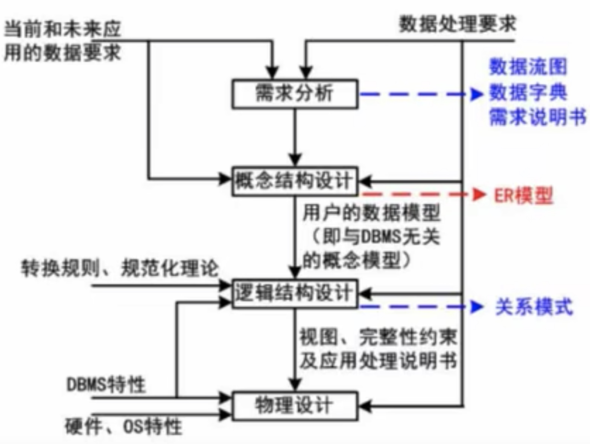

## 3.1 数据库模式
### 3.1.1 三级模式-两级映射

## 3.2 数据库的设计

## 3.3 E-R模型
集成的方法：
- 多个局部E-R图一次集成
- 逐步集成，用累加的方式一次集成两个局部E-R

集成产生的冲突及解决办法：
- 属性冲突：包括属性域冲突和属性取值冲突
- 命名冲突：包括同名异义和同名同义
- 结构冲突：包括同一对象在不同应用中具有不同的抽象，以及同一实体在不同局部E-R图中所包含的属性个数和属性排列次序不完全相同
## 3.4 关系代数
- 并
- 交
- 差
- 笛卡尔积
- 投影
- 选择
- 联接
## 3.5 规范化理论
### 3.5.1 函数依赖
>[!note]
>设R(U)是属性U上的一个关系模式，X和Y是U的子集，r为R的任一关系，如果对于r中的任意两个元组u，v，只要有u[X] = v[X]，则称X函数决定Y，或称Y函数依赖于X，记为X->Y。
### 3.5.2 规范化理论
>[!note]
>非规范化的关系模式，可能存在的问题包括：数据冗余、更新异常、插入异常、删除异常
### 3.5.3 键

>[!note] 求候选键
>- 将关系模式的函数依赖关系用“有向图”的方式表示
>- 找入度为0的属性，并以该属性集合为起点，尝试遍历有向图，若能正常遍历途中的所有结点，则该属性集即为关系模式的候选键
>- 若入度为0的属性集不能遍历图中的所有结点，则需要尝试性的将一些中间结点(即有入度，也有出度的结点)并入入度为0的属性集中，直至该集合能遍历所有结点，集合为候选键
### 3.5.4 范式

>[!note] 第一范式
>第一范式(1NF)：在关系模式R中，当且仅当所有域只包含原子值，即每个分量都是不可再分的数据项，则称R是第一范式。

>[!note] 第二范式
>第二范式(2NF)：当且仅当R是1NF，且每一个非主属性完全依赖主键(不存在部分依赖)时，则成R是第二范式。

>[!note] 第三范式
>第三范式(3NF)：当且仅当R时1NF，且E中没有非主属性传递依赖于码时，则称R是第三范式。

>[!note] BC范式
>BC范式(BCNF)：设R是一个关系模式，F是它的依赖集，R属于BCNF当且仅当其F中每个依赖的决定因素必定包含R的某个候选码。

### 3.5.5 模式分解
>[!note] 保持函数依赖分解
>设数据库模式δ = {R1,R2,..., Rk}是关系模式R的一个分解，F是R上的函数依赖集，δ中每个模式Ri上的FD集是Fi。如果{F1,F2,...,Fk}与F是等价的(即相互逻辑蕴含)，那么称分解δ保持FD

>[!note] 无损分解
>什么是有损，什么又是无损？
>有损：不能还原  无损：可以还原

>[!note] 无损联接分解
>指将一个关系模式分解成若干个关系模式后，通过自然联接和投影等运算仍能还原到原来的关系模式

>[!note] 定理
>如果R的分解为δ = {R1, R2}，F为R所满足的函数依赖集合，分解δ具有无损联接性的充分必要条件是：
>$$R_1 \cap R_2 \rightarrow (R_1-R_2)$$或$$R_1 \cap R_2 \rightarrow (R_2-R_1)$$其中，$$R_1 \cap R_2$$表示模式的交，为R1与R2中公共属性组成，R1-R2或R2-R1表示模式的差集，
R1-R2表示R1中去除R1和R2的公共属性所组成。当模式R分解成两个关系模式R1和R2时，如果R1与R2的公共属性函数能决定R1中或R2中的其他属性，这样的分解就具有无损联接性。
### 3.5.6 并发控制

>[!note] 封锁协议
>- 一级封锁协议。事务T在修改数据R之前必须先丢弃加X锁，直到事务结束才能释放。可防止丢失修改
>- 二级封锁协议。一级封锁协议加上事务T在读取数据R之前先对其加S锁，读完后即可释放S锁。可防止丢失修改，还可防止读“脏”数据
>- 三级分股搜协议。一级封锁协议加上事务T在读取数据R之前先对其加S锁，直到事务结束才释放。可防止丢失修改、防止读“脏”数据与防止数据重复读
>- 两段锁协议。可串行化的。可能发生死锁

### 3.5.7 数据库完整性约束
- 实体完整性约束
- 参照完整性约束
- 用户自定义完整性约束

- 触发器
### 3.5.8 数据库安全

### 3.5.9 数据备份
- 冷备份也称静态备份，是将数据库正常关闭，在停止状态下，将数据库的文件全部备份(复制)下来。
- 热备份也称动态备份，是利用备份软件，在数据库正常运行的状态下，将数据库中的数据文件备份出来。

 - 完全备份：备份所有数据
 - 差量备份：仅备份上一次完全备份之后变化的数据
 - 增量备份：备份上一次备份之后变化的数据

1. 静态海量转储：在系统中无运行事务时进行，每次转储全部数据库。
2. 静态增量转储：在系统中无运行事务时进行，每次只转储上一次转储后更新过的数据。
3. 动态海量转储：转储期间允许对数据库进行存取或修改看，每次转储全部数据库。
4. 动态增量转储：转储期间允许对数据库进行存取或修改，每次只转储上一次转储后更新过的数据。
>[!note] 日志文件
>事务日志是针对数据库改变所做的记录，它可以记录针对数据库的任何操作，并将记录结果保存在独立的文件中

### 3.5.10 数据库故障与恢复

### 3.5.11 数据仓库与数据挖掘
- 面向主题
- 集成的
- 相对稳定的(非易失的)
- 反映历史变化(随着时间变化)

>[!note] 数据玩具方法分类
>>[!example] 方法
>> - 决策树
>> - 神经网络
>> - 遗传算法
>> - 关联规则挖掘算法
>
>>[!example] 分类
>> - 关联分析：挖掘出隐藏在数据间的相互关系。
>> - 序列模式分析：侧重点是分析数据间的前因后果关系(因果关系)。
>> - 分类分析：为每一个记录赋予一个标记再按标记分类
>> - 聚类分析：分类分析法的逆过程

### 3.5.12 反规范化技术
>[!note]
>由于规范化会使表不断的拆分，从而导致数据表过多。这样虽然减少了数据冗余，提高了增、删、改的速度，但会增加查询的工作量。系统需要进行多次连接，才能进行查询操作，使得系统效率大大下降
>>[!tip] 技术手段
>>- 增加派生性冗余列
>>- 增加冗余列
>>- 重新组表
>>- 分割表

### 3.5.13 大数据
>[!note] 4V特征
> - Volume 规模性
> - Velocity 高速性
> - Variety 多样性
> - Value 价值性

>[!note] 大数据处理系统应该具有的重新特征
> - 高度可扩展性
> - 高性能
> - 高度容错
> - 支持异构环境
> - 较短的分析延迟
> - 易用且开放的接口
> - 较低成本
> - 向下兼容
