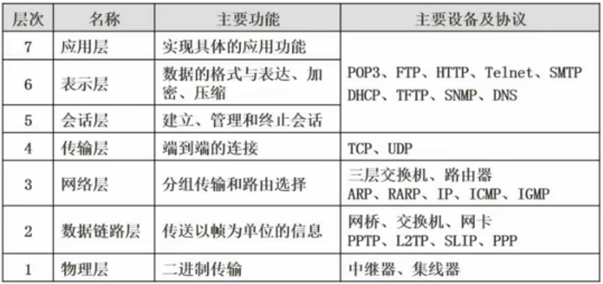
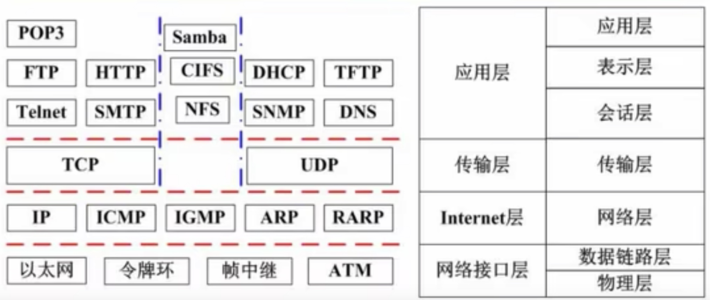
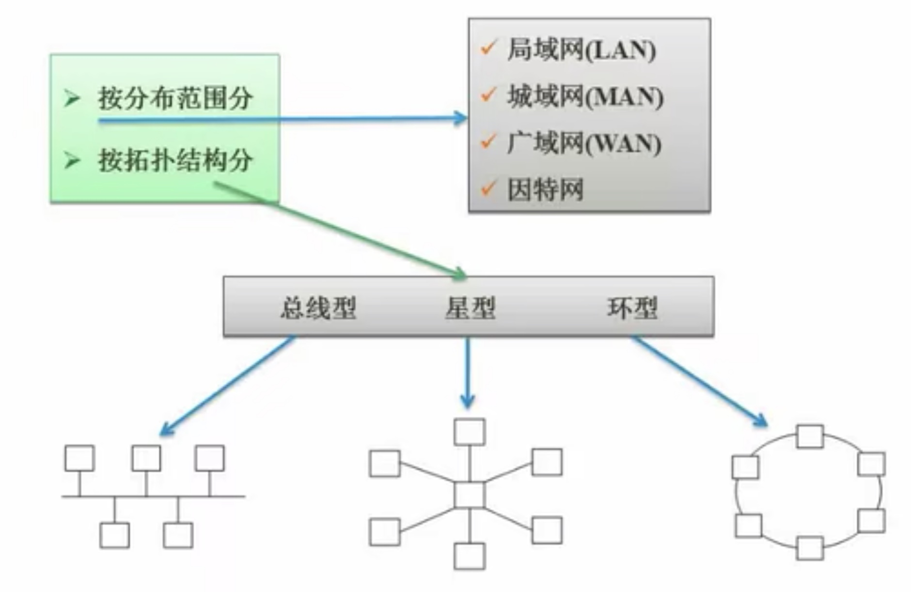
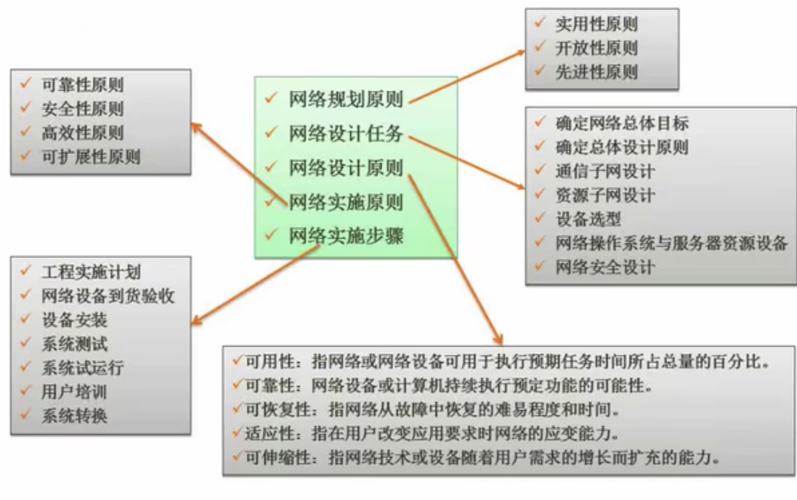
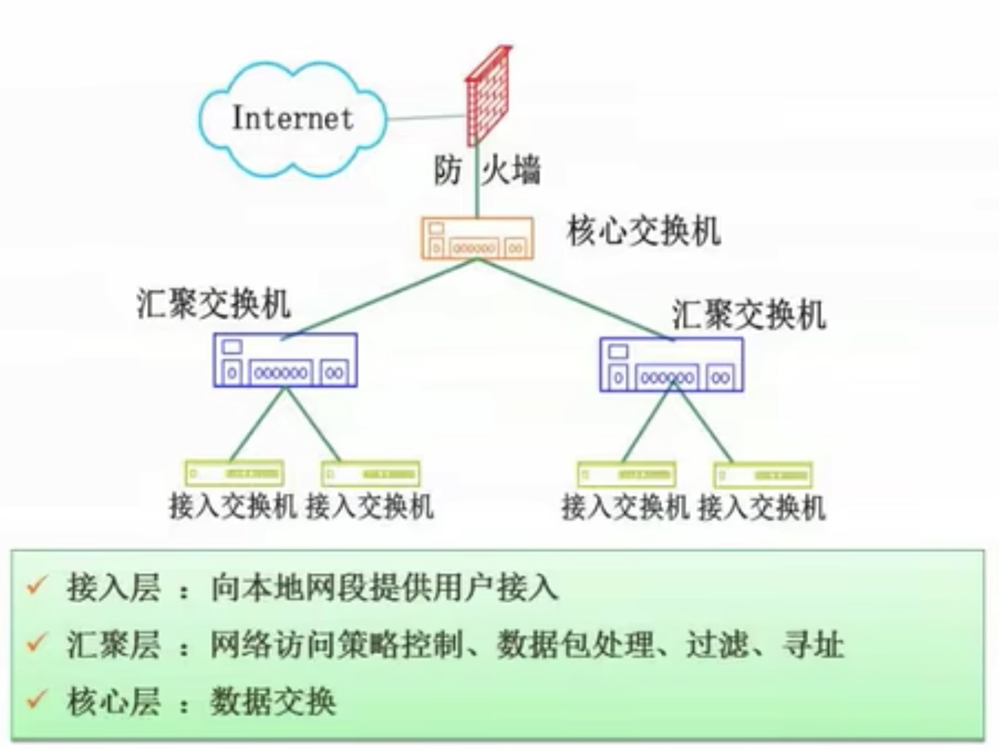
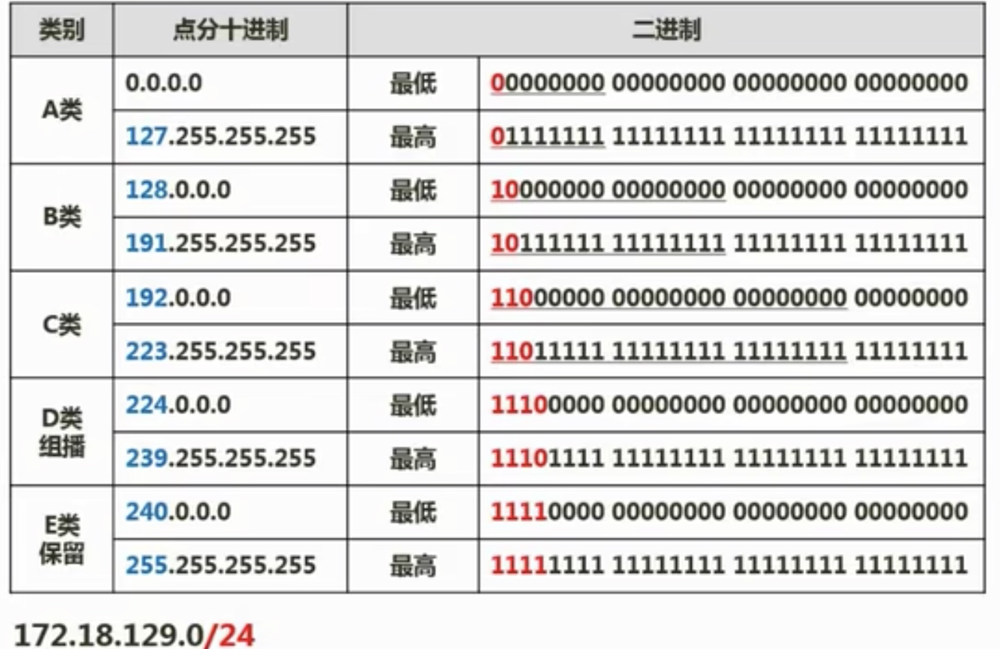
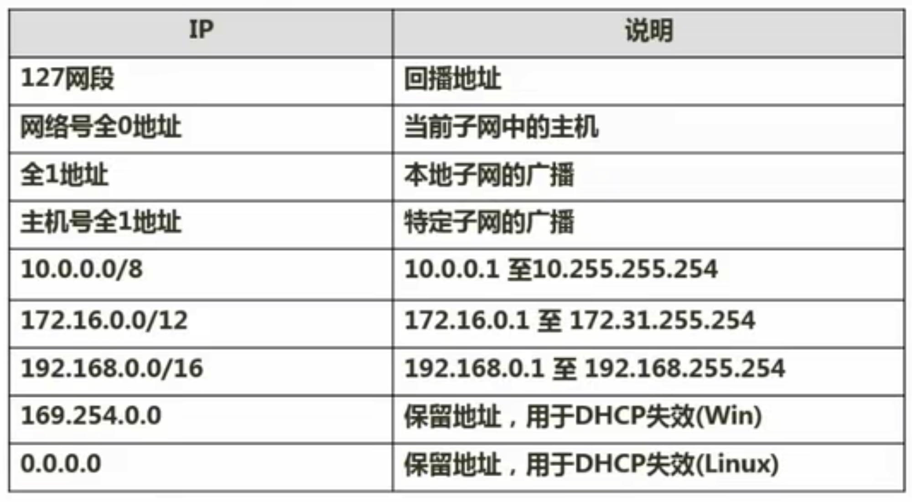

## 4.1 七层模型

## 4.2网络技术标准与协议
- TCP/IP协议：Internet，可扩展，可靠，应用最广，牺牲速度和效率
- IPX/SPX协议：NOVELL，路由，大型企业网
- NETBEUI：IBM，非路由，快速

### 4.2.1 TCP协议
TCP三次握手
DHCP协议
DNS协议
## 4.3 计算机网络的分类

## 4.4 网络规划与设计

### 4.4.1 逻辑网络设计
>[!note]
利用需求分析和现有网络体系分析的结果来设计逻辑网络结构，最后得到一份逻辑网络设计文档，输出内容包括一下几点：
>>[!example] 设计文档
>- 逻辑网络设计图
>- IP地址方案
>- 安全方案
>- 具体的软硬件、广域网连接设备和基本服务
>- 招聘和培训网络员工的具体说明
>- 对软硬件、服务、员工和培训的费用初步估计
### 4.4.2 分层设计

## 4.5 IP地址与子网划分
### 4.5.1 IP地址

### 4.5.2 子网划分
1. 子网掩码
2. 将一个网络划分成多个子网(取部分主机号当子网号)
3. 将多个网络合并成一个大的网络(取部分网络号当主机号)
### 4.5.3 无分类编址(无类域间路由)
IP地址 ::= {<网络前缀>， <主机号>}
>[!note]
>128.14.32.0/20表示的地址块共有212个地址。
>这个地址块的起始地址是128.14.32.0.
>在不需要支出地址块的起始地址时，也可将这样的地址块简称为“/20地址块”。
>128.14.32.0/20地址块的最小地址：128.14.32.0
>128.14.32.0/20地址块的最大地址：128.14.32.255
>全0和全1的主机号地址一般不使用

## 4.6 特殊含义的IP地址

## 4.7 HTML
## 4.8 无线网
>[!success] 优势
>- 移动性
>- 灵活性
>- 成本低
>- 容易扩充

>[!note] 接入方式
>- 有接入点模式
>- 无接入点模式

- 无线局域网(WLAN，802.11，Wi-Fi)
- 无线城域网(WMAN，802.16，WiMax)
- 无线广域网(WWAN，3G/4G)
- 无线个人网(WPAN，802.15，Bluetooth)
## 4.9 网络接入技术
>[!example] 有线接入
> - 公用交换电话网络(PSTN)
> - 数字数据网(DDN)
> - 综合业务数字网(ISDN)
> - 非对称数字用户线路(ADSL)
> - 同轴光纤技术(HFC)

>[!example] 无线接入
> - IEEE 802.11(WiFi)
> - IEEE 802.15(蓝牙Bluetooth)
> - 红外(IrDA)
> - WAPI

>[!example] 3G/4G
> - WCDMA
> - CDMA2000
> - TD-SCDMA
> - LTE-Advanced
> - WirelessMAN-Advanced(802.16m)(WiMAX)

## 4.10 IPv6
IPv6是设计用于替换现行版IP协议(IPv4)的下一代IP协议。
1. IPv6地址成都为128位，地址空间增大了296倍；
2. 灵活的IP报文头部格式，使用一系列固定格式的扩展头部取代了IPv4中可变长度的选项字段。IPv6中选项部分的出现方式也有所变化，使路由器可以简单路过选项而不做任何处理，加快了报文处理速度；
3. IPv6简化了报文头部个事，字段只有8个，加快报文转发，提高了吞吐率；
4. 提高安全性，身份认证和隐私权是IPv6的关键特征性；
5. 支持更多的服务类型
6. 允许协议继续演变，增加新的功能，使之适应未来技术的发展；

- 单播地址(Unicast)：用于单个接口的标识符。
- 任播地址(Anycast)：泛播地址。一组接口的标识符，IPv4广播地址。
- 组播地址(Multicast)：IPv6中的组播在功能上与IPv4中的组播类似。