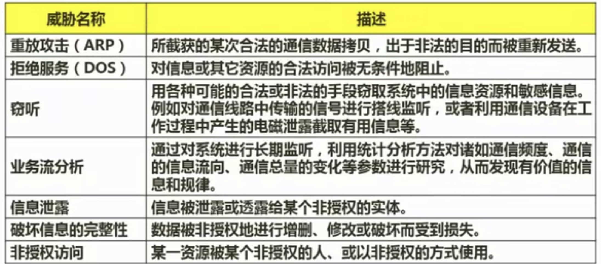
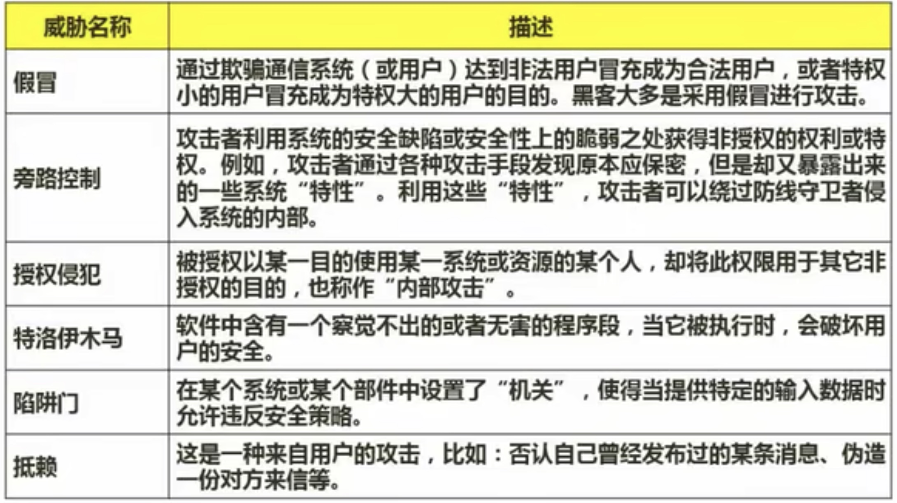
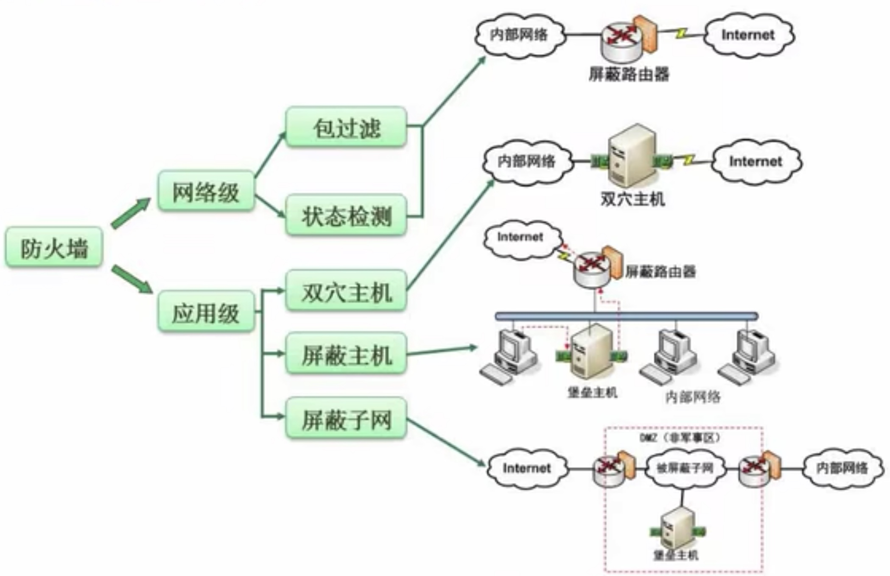

## 5.1 信息系统安全属性
>[!tip] 安全属性
> - 保密性：最小授权原子、防暴露、信息加密、物理保密
> - 完整性：安全协议、校验码、密码校验、数字签名、公正
> - 可用性：综合保障(IP过滤、业务流控制、路由选择控制、审计跟踪)
> - 不可抵赖性：数字签名

## 5.2 对称加密和非对称加密
>[!note] 常见对称密钥加密算法
> - DES：替换+移位、56位密钥、64位数据库、速度快、密钥易产生
> - 3DES(3重DES)：两个56位的密钥K1、K2
>   加密：K1加密->K2解密->K1加密
>   解密：K1解密->K2加密->K1解密
> - AES：高级加密标准Rijindae加密法，是马克过联邦政府采用的一种区块加密标准。这个标准用来替换原先的DES，对其要求是“至少与3DES一样安全”。
> - RC-5：RSA数据安全公司的很多产品都使用了RC-5。
> - IDEA算法：128位密钥、64位数据块、比DES的加密性好、对计算机功能要求相对低，PGP。

>[!missing] 缺陷
> 1. 加密强度不高
> 2. 密钥分发困难

>[!note] 非对称密钥加密算法
> - RSA：512(或1024位)密钥、计算量极大、难破解
> - Elgamal：其基础是Diffie-Hellman密钥交换算法
> - ECC：椭圆曲线算法
> - 其他非对称算法包括：背包算法、Rabin、D-H

>[!missing] 缺陷
>  - 加密速度慢

## 5.3 信息摘要
单向散列函数(单向Hash函数)、固定长度的散列值。

常用的消息摘要算法有MD5，SHA等，市场上广泛使用的MD5，SHA算法的散列值分别为128和160位，由于SHA通常采用的密钥长度较长，因此安全性高于MD5。

## 5.4 数字签名
## 5.5 数字信封与PGP
 - 发送方将原文用对称密钥加密传输，而将对称密钥用接受方公钥加密发送给对方。
 - 接受方收到电子信封，用自己的私钥解密信封，去除对称密钥解密得原文。

>[!example]
> - PGP可用于电子邮件，也可以用于文件存储。采用了杂合算法，包括IDEA、RSA、MD5、ZIP数据压缩算法。
> - PGP承认两种不同的证书格式：PGP证书和X.509证书
> - PGP证书包含PGP版本号、证书吃后者公钥、证书持有者信息、证书拥有者的数字签名、证书的有效期、密钥首选的对称加密算法。
> - X.509证书包含证书版本、证书的序列号、签名算法标识、证书有效期、以下数据：证书发行商名字、证书主题名、主体公钥信息、发布者的数字签名。

## 5.6 各个网络层次的安全保障
## 5.7 网络威胁与攻击

## 5.8 防火墙
