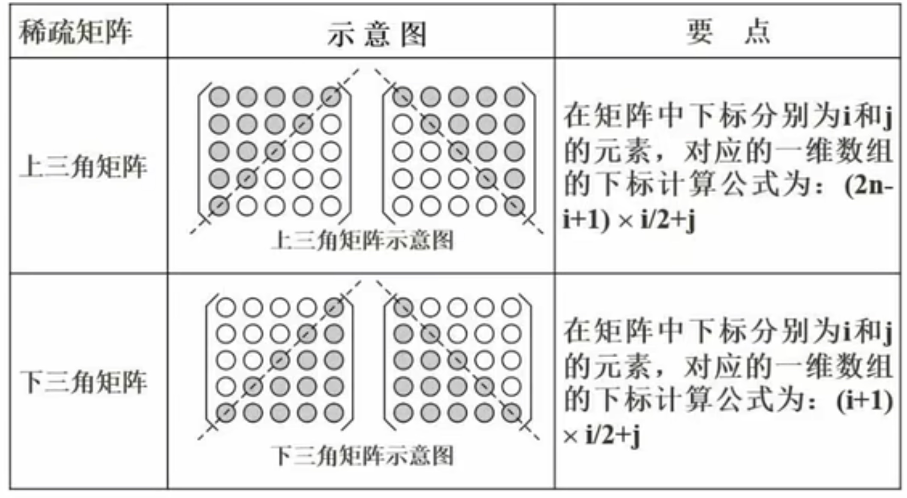
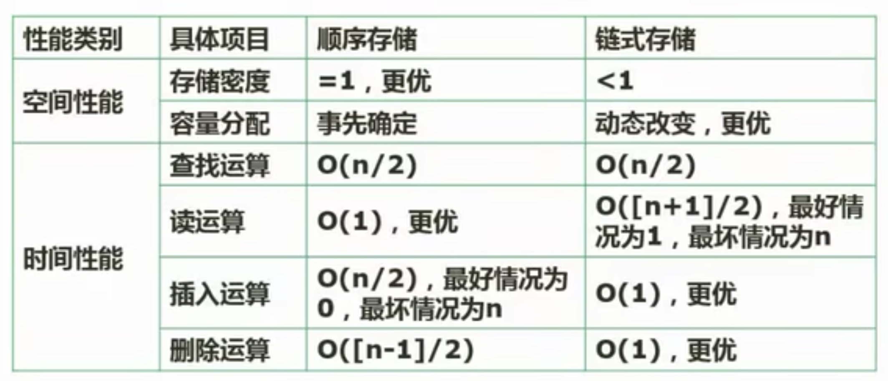
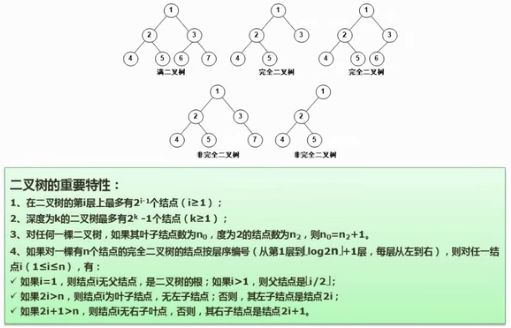
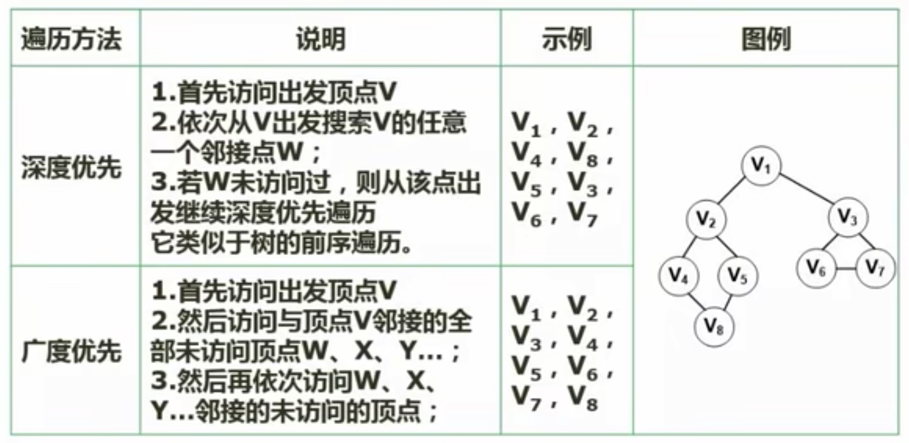
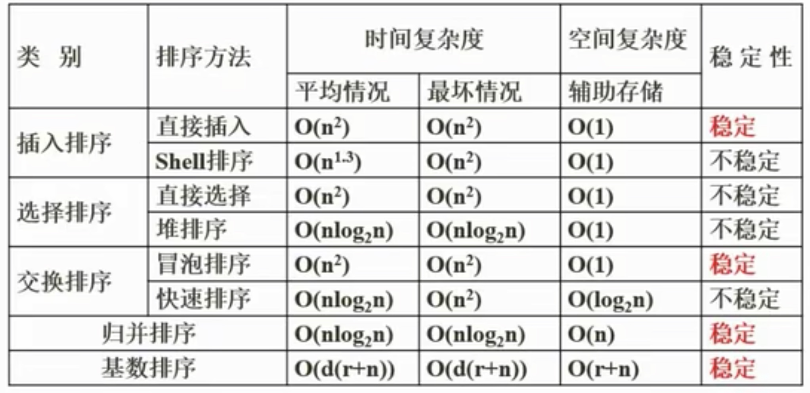

## 6.1 数组
一维数组存储地址为：
a[i]：a + i * len

二维数组的存储地址：
a[i][j]按行存储为：a + (i * n + j) * len
a[i][j]按列存储为：a + (j * m + i) * len

## 6.2 稀疏矩阵

## 6.3 数据结构的定义
线性结构
非线性结构

## 6.4 线性表
- 顺序存储结构 顺序表
	- 数组
- 链式存储结构 链表
	- 单链表
	- 循环链表
	- 双向链表

## 6.5 顺序存储和链式存储

## 6.6 队列与栈
队列：先进先出
栈：先进后出

## 6.7 广义表
>[!note] 广义表
>n个表元素组成的有限序列，是线性表的推广。
>通常用递归的形式进行定义，记作：
>$$ LS = (a_0,a_1,...,an)。$$
>注：其中LS是表名，ai是表元素，它可以是表(称做子表)，也可以是数据元素(称为原子)。其中n是广义表的长度(也就是最外层包含的元素个数)，n = 0的广义表为空表；而递归定义的重数就是广义表的深度，直观的说，就是定义中所含括号的重数(原子的深度为0，空表的深度为1)。
>基本运算：取表头head(Ls)和取表尾tail(Ls)。
>若有：LS1 = (a，(b，c)，(d，e))
>head(LS1) = a
>tail(LS1) = ((b，c)，(d，e))

## 6.8 树与二叉树
 - 结点的度
 - 树的度
 - 叶子结点
 - 分支结点
 - 内部结点
 - 父结点
 - 子结点
 - 兄弟结点
 - 层次
## 6.9 满二叉树和完全二叉树

## 6.10 二叉树遍历
- 前序遍历
- 中序遍历
- 后续遍历
- 层次遍历
## 6.11 反向构造二叉树
## 6.12 树转二叉树
## 6.13 查找二叉树
## 6.14 最优二叉树(哈夫曼树)
- 树的路径长度
- 权
- 带权路径长度
- 树的带权路径长度(树的代价)
## 6.15 线索二叉树
## 6.16 平衡二叉树
>[!note] 定义
> - 任意结点的左右子树深度相差不超过1
> - 每结点的平衡度只能为-1、0或1

## 6.17 图
>[!note] 完全图
> - 在无向图中，若每对顶点之间都有一条边相连，则称该图为完全图(completegraph)。
> - 在有向图中，若每对顶点之间都有二条有向边相互连接，则称该图为完全图。

图的存储：
- 临接矩阵
- 临接表

## 6.18 图的遍历

## 6.19 拓扑排序
>[!note] 
>用有向边表示活动之间开始的先后关系。这种有向图称为用顶点表示活动网络，简称AOV网络。

## 6.20 图的最小生成树(普里姆算法)
## 6.21 算法的特性
> [!info]
> - 有穷性：执行有穷步之后结束。
> - 确定性：算法中每一条指令都必须有确切的含义，不能含糊不清
> - 输入(>=0)
> - 输出(>=1)
> - 有效性：算法的每个步骤都能有效执行并能得到确定的结果。例如a=0，b/a就无效。

## 6.22 算法的复杂度
>[!note] 时间复杂度
>程序运行从开始到结束所需要的事件。通常分析时间复杂度的方法是从算法中选取一种对于所研究的问题来说是基本运算的操作，以该操作重复执行的次数作为算法的事件度量。一般来说，算法中原操作重复执行的次数是规模n的某个函数T(n)。由于许多情况下要精确计算T(n)是困难的，因此引入了渐进时间复杂度在数量上估计一个算法的执行时间，其定义如下：
>如果存在两个常数c和m，对于所有的n，当n>=m时f(n)<=cg(n)，则有f(n)=O(g(n))，也就是说，随着n的增大，f(n)渐进的不大于g(n)，例如，一个程序的实际执行时间为$$T(n)=3n^3+2n^2+n$$，则$$T(n)=O(n^3)$$
>常见的对算法执行所需时间的度量：
>$$O(1)<O(log_2n)<O(n)<O(nlog_2n)<O(n^2)<O(n^3)<O(2^n)$$

>[!note] 空间复杂度
>对一个算法在运行过程中临时占用存储空间大小度量。一个算法的空间复杂度只考虑在运行过程中为局部变量分配的存储空间的大小。

## 6.23 顺序查找和二分查找
## 6.24 散列表
## 6.25 排序
 - 稳定排序
 - 不稳定排序
 - 内排序
 - 外排序

排序方法分类
- 插入类排序
	- 直接插入排序
	- 希尔排序
- 交换类排序
	- 冒泡排序
	- 快速排序
- 选择类排序
	- 简单选择排序
	- 堆排序
- 归并排序
- 基数排序
## 6.26 排序算法的时间复杂度和空间复杂度

