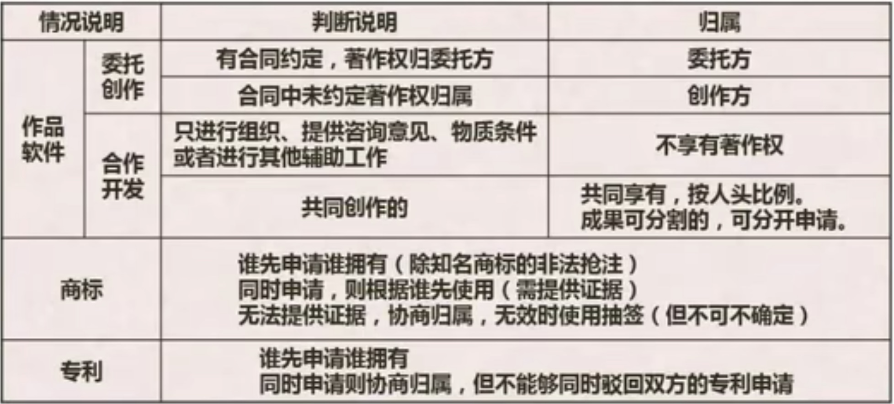

## 8.1 保护期限

## 8.2 知识产权人确定

## 8.3 侵权判定
 - 中国公民、法人或者其他组织的作品，无论是否发表，都享有著作权。
 - 开发软件所用的思想、处理过程、操作方法或者数学概念不受保护

>[!example] 著作权法不适用于下列情形
> - 法律、法规，国家机关的决议、决定、命令和其他具有立法、行政、司法性质的文件，及其官方正式译文；
> - 时事新闻
> - 历法、通用数表、通用表格和公式

## 8.4 标准化基础知识
>[!note] 标准的分类
> - 国际标准：ISO、IEC等国际标准化组织
> - 国家标准：GB-中国、ANSI-美国、BS-英国、JIS-日本
> - 区域标准：又称为地区标准，如PASC-太平洋地区标准会议、CEN-欧洲标准委员会、ASAC-亚洲标准咨询委员会、ARSO-非洲地区标准化组织
> - 行业标准：GJB-中国军用标准、MIT-S-美国军用标准、IEEE-美国电气电子工程师协会
> - 地方标准：国家的地方一级行政机构制订的标准
> - 企业标准
> - 项目规范

>[!note] 标准的编号
> - 国际、国外标准代号：标准代号+专业类号+顺序号+年代号
> - 我国国家标准代号：强制性标准代号为GB，推荐性标准代号为GB/T，指导性标准代号为GB/Z、实物标准代号GSB
> - 行业标准代号：由汉语拼音大写字幕组成(如电子行业为SJ)
> - 地方标准代号：由DB加上省级行政区域代号的前两位
> - 企业标准代号：由Q加上企业代号组成