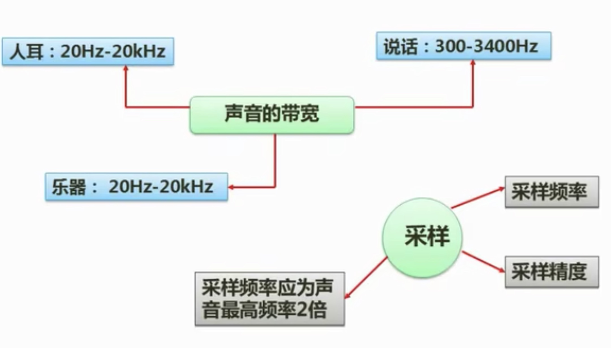
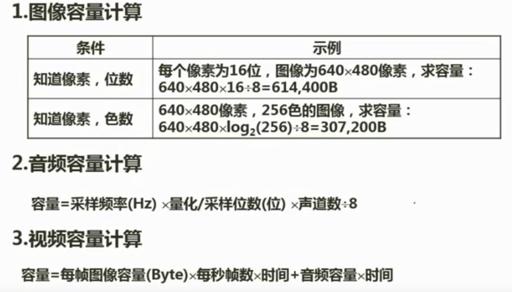
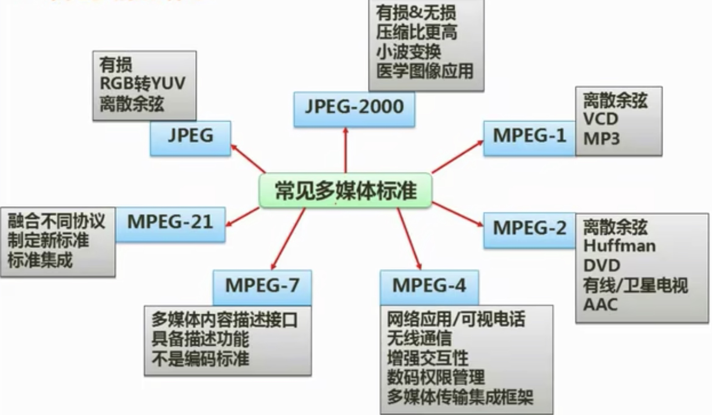

## 9.1 音频相关概念

## 9.2 图像相关概念
 - 亮度
 - 色调
 - 饱和度
>[!tip] 色彩空间
> - RGB
> - YUV(电视、兼容)
> - CMY(CMYK)
> - HSV(HSB)

## 9.3 媒体的种类
>[!tip]
> - 感觉媒体：人们接触信息的感觉形式。如：视觉、听觉、触觉、嗅觉和味觉等。
> - 表示媒体：信息的表示形式。如：文字、图形、图像、动画、音频和视频等。
> - 显示媒体(表现媒体)：表现和获取信息的物理设备。如：输入显示媒体键盘、鼠标和麦克风等；输出显示媒体显示器、打印机和音箱等。
> - 存储媒体：存储数据的物理设备，如：磁盘、光盘和内存等。
> - 传输媒体：传输数据的物理载体，如：电缆、光缆和交换机设备等。

## 9.4 多媒体计算问题

## 9.5 常见多媒体标准

## 9.6 数据压缩
>[!tip]
> - 空间冗余(几何冗余)
> - 时间冗余
> - 视觉冗余
> - 信息熵冗余
> - 结构冗余
> - 知识冗余

## 9.7 有损压缩和无损压缩