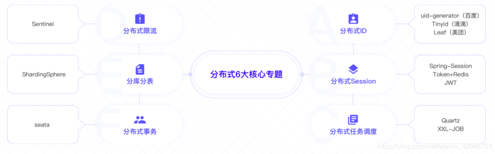
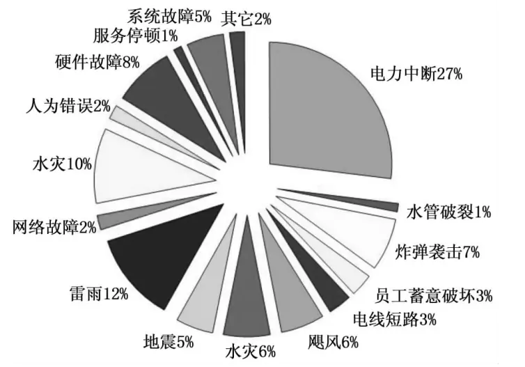
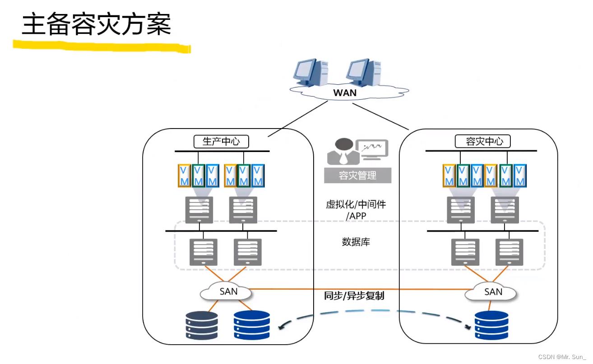
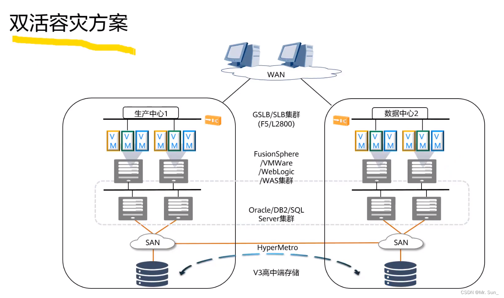
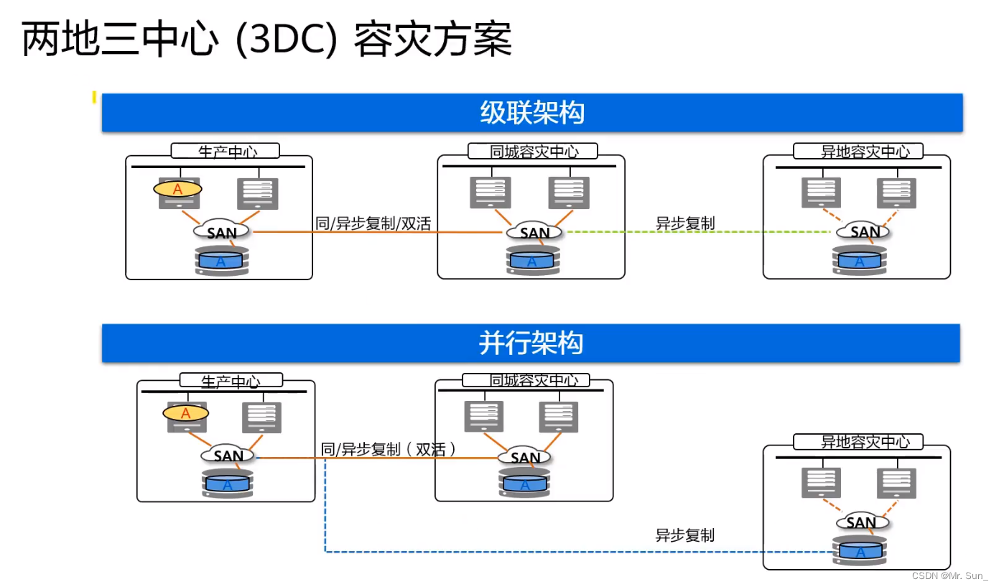

#知识管理/软件 

## 集群

 - 集群是一种计算系统，通过一组计算机或服务器的软硬件连接起来高密度的协作完成计算工作，客户端看来为其提供服务的只有一台设备，实际上它是一群设备的集合，只不过这些设备提供的服务一样。
 - 集群系统中单个计算机成为节点，通过局域网连接，利用多个计算机进行并行计算，获得很高的计算速度，也可以用多个计算机做备份提高可靠性。
 - 集群主要的使用场景是为了分担请求的压力。

### 集群策略

 - 虚拟机HA(High Availability)高可用性，一种让服务中断尽可能少的技术。
	 - 将多台主机组建成一个故障转移集群，运行在集群上的服务(或VM)不会因为单台主机的故障停止。
	 - 提升故障恢复速度，降低业务中断时间、保障业务连续性、实现一定的系统自维护。
 - 动态资源调度(DRS)
	 - DRS(Dynamic resource scheduling)动态资源调度，根据对资源池资源负载的动态监控，合理触发均匀分配规则，实现资源池中的物理服务器之间重新分配资源，达到负载均衡、消峰填谷
	 - 当物理服务器上负载过大时，通过DRS将虚拟机迁移到其他负载较轻的物理服务器上
	 - 当虚拟机遇到负载增大时，DRS将为资源池中的物理服务器重新分配虚拟机可使用资源(比如CPU、内存、IO等)，在多个虚拟机之间智能的分配可用资源 
 - 分布式电源管理(DPM)
	 - DPM(Distributed power management)，用于业务较轻时，把虚拟机动态“集中”到集群中的少部分主机上，将其他主机待机，节省电力消耗，等业务量较大时，再重新唤醒之前待机的主机。
	 - 执行DPM策略的前提是开启DRS策略，即集群必须先设置好DRS策略，才能设置DPM策略。

## 分布式

 - 分布式是指多个系统协同合作完成一个特定任务的系统。它是不同的系统部署在不同的服务器上，服务器之间相互调用。
 - 分布式的主要工作是分解任务，把职能拆解。
 - 主要应用场景是单台机器已经无法满足这种性能的要求，必须要融合多个节点，并且节点之间的相关部分是有交互的。

## 集群和分布式的区别

 - 分布式：把一个大业务拆分成多个子业务，每个子业务都是一套独立的系统，子业务之间相互协作最终完成整体的大业务。
 - 集群：把处理同一个业务的系统部署多个节点。
 - 把一套系统拆分成不同的子系统部署在不同服务器上，这叫分布式。
 - 把多个相同的系统部署在不同的服务器上，这叫集群。
 - 集群主要是简单加机器解决问题，对于问题本身不做任何分解。
 - 分布式必然涉及任务分解与答案归并。分布式中的某个子任务节点，可以是一个集群，该集群中的任一节点都作为一个完整的任务出现。
 - 集群和分布式都是由多个节点组成，但集群中各节点间基本不需要通信协调，而分布式中各个节点的通信协调是必不可少的。

## CAP原则

CAP原则又称CAP定理，指的是在一个分布式系统中，一致性(Consistency)、可用性(Availability)、分区容错性(Partition tolerance)。CAP 原则指的是，这三个要素最多只能同时实现两点，不可能三者兼顾。

- 一致性
	一致性指的是分布式系统完成某个写操作时，服务器的各个节点都应该获取到最新的值，保持各个节点之间的数据一致性。
- 可用性
	可用性指的是在分布式系统中，用户可以永远在正常时间内进行读和写操作，一直可以正常访问并得到响应。
- 分区容错性
	分区容错性是指，在分布式系统中，其中一个节点宕机，整个系统还是能满足一致性和可用性的服务，就是说部分故障不影响整体使用，所以在项目架构时都会考虑一些外部因素造成的故障，都是要求部分故障不影响整体使用的。

CP：优先保证一致性和分区容错性，在数据一致性要求比较高的场合使用，在出现问题时牺牲用户体验，恢复之后用户正常访问。

CP案例：Zookeeper
Zookeeper不能保证每次请求的可用性，如果其中一个节点宕机或者在和另外一个节点同步数据的时候网络发生问题，请求就会出问题，会等恢复正常数据同步之后才会继续可以访问

AP：优先保证可用性和分区容错性，其中一个节点出问题之后还是能正常访问，不会影响用户体验，但是可能接收到的数据不是最新的数据，恢复之后数据变一致。

AP案例：Eureka
在其中一个节点出问题时，其他节点可以正常访问，只不过可能数据不是最新数据，Eureka还有自我保护机制，在运行期间统计心跳失败的比例，在15分钟之内是否小于85%，如果低于的话就会将这些实例保护起来，不会注销此项服务.

## 容灾架构

容灾也就是对灾难的抵抗和防御，目的就是提高信息系统抵御灾难和重大事故的能力， 减少灾难打击和重大事故对企业造成的损失，保证应用的可用性、数据的可靠性、业务的连续性。

容灾架构的技术核心是实现异地数据备份，并能够在灾难发生时在异地利用备份的数据提供企业业务恢复服务，因此数据复制技术是容灾架构技术的核心。

### 容灾级别：
1. 数据级容灾：通过建立异地容灾中心，做数据的远程备份，在灾难发生之后要确保原有的数据不会丢失或者遭到破坏，但在数据级容灾这个级别，发生灾难时应用是会中断的。可以简单的把这种容灾方式理解成一个远程的数据备份中心，就是建立一个数据的备份系统或者一个容灾系统，比如数据库、文件等等
2. 应用级容灾：在数据级容灾的基础之上，在备份站点同样构建一套相同的应用系统，通过同步或异步复制技术，这样可以保证关键应用在允许的时间范围内恢复运行，尽可能减少灾难带来的损失，让用户基本感受不到灾难的发生。
3. 业务级容灾：全业务的灾备，除了必要的IT相关技术，还要求具备全部的基础设施。
### 衡量容灾的指标：
- RPO(Recovery Point Objective)代表了当容灾发生时，允许丢失的数据量。
- RTO(Recovery Time Objective)代表了系统恢复的时间。
- RPO和RTO越小，系统的可用性就越高。
### 容灾方案
- 主备容灾

- 双活容灾

- 两地三中心(3DC)容灾

## 微服务

> [!NOTE] 微服务(Microservice)
> 是一种软件架构风格，它是以专注于单一职责和小型功能区块(Small Building Blocks)为基础，利用模块化的方式组合出复杂大型的应用程序，微服务之间相互解耦，以自动化的方式部署，各个功能区块可以使用不同的语言，区块之间使用与语言无关(Language-Independent/Language agnostic)的API集相互通信。
> 

### 特性
 
 1. 服务组件化
	- 每一个组件都有完整的生命周期，包含自己的API，可以独立存在
 2. 按照业务组织团队
	- 缩小模块的边界，每个模块可以独立负责
 3. 做产品的态度
	- 模块的Owner要以产品的思维考虑模块的设计与演进
 4. 只能端点和哑管道
	- 服务之间调用的端点可以动态获取以服务发现的方式提供，对于出错的场景提供熔断器
 5. 去中心化治理
	- 根据业务特点选择语言与框架
 6. 去中心化管理数据
	- 不同的模块使用不同的库或者不同的表，不会出现相互调用的场景
 7. 基础设施自动化
	- 自动化部署、自动化交付
 8. 容错设计
	- 组件是不可信的，对于失败的状态需要有降级处理
 9. 演进式设计
	- 设计组件的时候需要明确和规划组件的边界
 

> [!success] 优点
> 1. 通过将大型的单体系统拆分成多个微服务，可以解决应用复杂性的问题，并且每个微服务可以更好的切分业务场景。
> 2. 每个模块都有专门的团队和人员负责，可以选择最合适的技术进行实现，使得架构演进更简单，降低历史技术债务。
> 3. 微服务之间相互并不影响与依赖，降低耦合度，可以独立升级。
> 4. 微服务切分后都是独立部署，可以根据业务的特征动态调整资源。
> 

> [!fail] 缺点
> 1. 将一个大型的系统拆分成微服务涉及系统的分布式改造，带来了固然的技术成本
> 2. 更清晰的边界划分也使得标准化变得困难，微服务依赖上层的框架进行规约
> 3. 单体应用内部的通信成本远低于微服务组件间的通信
> 4. 管理多个组件或者组件拓扑成为微服务系统的头等要务
> 5. 数据库的设计与业务规划成为微服务中的难点，对开发者提出更多的要求

## 中台

### 中台解决的问题

1. 技术层面
	多项目且项目相对独立，导致需要重复造轮子，如：文件上传、订单模块、支付模块、搜索模块、日志模块等...引起的研发周期长，程序员996了都不能灵活应对业务变化的情况
2. 业务层面
	项目相对独立，技术重复造引起的 研发周期长、面对市场需求总是慢半拍(不灵活)、试错成本高、不利于创新

### 中台解决的方式

- 通过统一的公共技术模块抽离形成服务。再次需要该服务时通过接口调用完成，避免重复造轮子，避免研发周期拉长
- 明确业务流程，封装成公共业务流程模块。当下次走同样业务流程时直接复用。降低试错成本，有利创新
- 到时候技术研发的就不是项目，而是这些 “公共模块” 形成的服务，形成的中台

