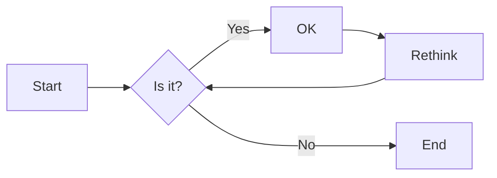
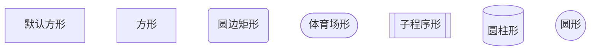
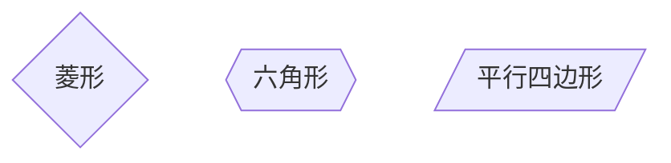
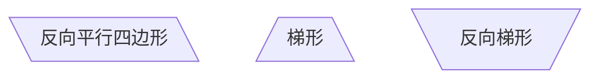
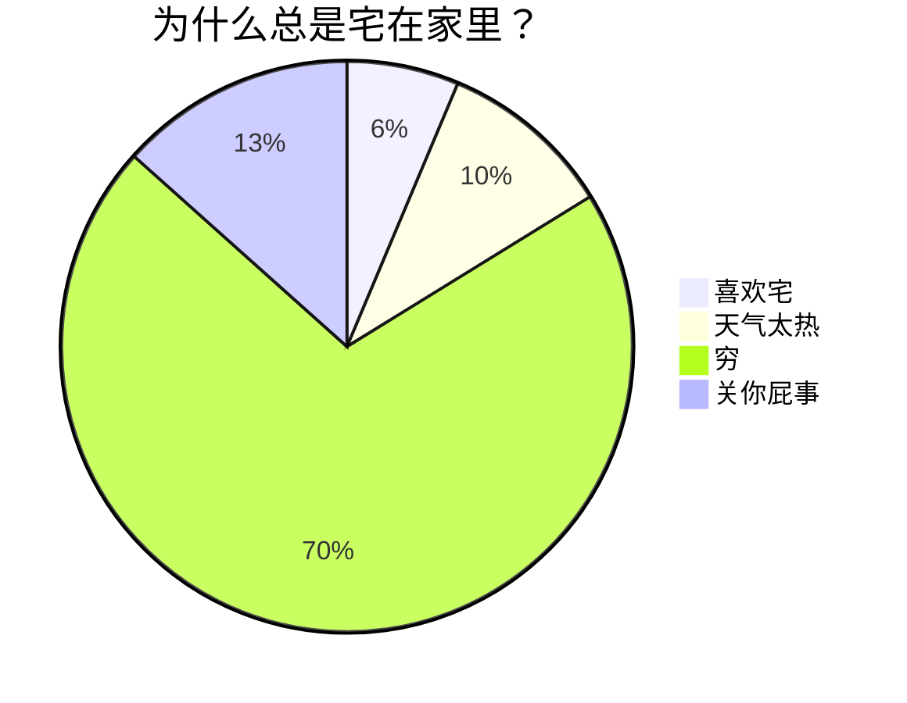

---
banner: "![[../../image/ishan-seefromthesky-JQGEj_ayWIg-unsplash.jpg]]"
banner_y: 0.504
---

#知识管理/技能

# 1.标题&目录

## 1.1 标题

`# 这是一级标题 `

`## 这是二级标题 `

`### 这是三级标题 `

`#### 这是四级标题 `

`##### 这是五级标题 `

`###### 这是六级标题`

## 1.2 目录

`[toc]`
注意：Obsidian不支持自动生成目录，其自带大纲

# 2.斜体&粗体

## 2.1 斜体

`*斜体*`：*文本内容*

`_斜体_`：_文本内容_

## 2.2 粗体

`**粗体**`：**文本内容**

`__粗体__`：__文本内容__ 

## 2.3 粗斜体(斜粗体)

`***粗斜体***`：***文本内容***

`___粗斜体___`：___文本内容___

`__*粗斜体*__`：__*文本内容*__

`**_粗斜体_**`：**_文本内容_**

`_**粗斜体**_`：_**文本内容**_

`*__粗斜体__*`：*__文本内容__*

## 2.4 斜体包含粗体

`*斜体中包含**粗体**的文本*`：*斜体中包含**粗体**的文本*

`_斜体中包含 __粗体__ 的文本_`：_斜体中包含 __粗体__ 的文本_

## 2.5 粗体包含斜体

`**粗体中包含*斜体*的文本**`：**粗体中包含*斜体*的文本**
`__粗体中包含 _斜体_ 的文本__`：__粗体中包含 _斜体_ 的文本__

# 3.线

## 3.1 水平分割线

`---`：

---

`***`：

***

## 3.2 文本删除线

`~~文本删除线~~`：~~文本内容~~

## 3.3 文本下划线

`<u>文本下划线</u>`：<u>文本内容</u>

# 4.列表&应用

## 4.1有序列表

`1.+ 空格 + 文本内容`：

1. 文本内容
2. 文本内容

## 4.2 无序列表

`- + 空格 + 文本内容`：

- 文本内容

- 文本内容

## 4.3引用

`>文本内容`：

> 文本内容

`>>文本内容`：

>
>> 文本内容

## 4.4缩进&退格

缩进：<kbd>Tab</kbd>、<kbd>Command</kbd> + <kbd>]</kbd>

退格：<kbd>Shift</kbd> + <kbd>Tab</kbd>、<kbd>Command</kbd> + <kbd>[</kbd>

# 5.网页链接与图像

## 5.1 网页链接

`[显示文本内容](链接地址 + 空格 + "提示信息")`：

[百度一下，你就知道](http://www.baidu.com "按住Ctrl点击跳转百度")

## 5.2 图像

``

# 6.表格

`Typora中插入表格：option + command + T`

| 表头1   | 表头2   |
| ------- | ------- |
| 单元格1 | 单元格2 |
| 单元格3 | 单元格4 |

# 7.代码域

## 7.1 行内代码

在两个反撇号<kdb>`</kdb>的中间写代码内容

`行内代码`

## 7.2 代码块

在首行和末行各加三个反撇号<kdb>`</kdb>或三个波浪号<kdb>~</kdb>

```python
print "Good bye!"
```

~~~javascript
console.log("hello!");
~~~

# 8.任务列表(待办)

`- + 空格 + [空格] + 空格 + 任务列表内容 `：

- [ ] 学习MarkDown语法

# 9.注释

`<!-- 注释内容 -->`：

<!-- 注释内容 -->

Obsidian中，使用`%% 注释内容 %%`

# 10.变量

## 10.1 网页链接变量

`step1. [显示文本内容][变量名]`

`step2. [变量名]: + 空格 + 链接地址`

[知乎-有问题，就会有答案][知乎]

[知乎]:https://www.zhihu.com

## 10.2 脚注

`step1. [^脚注代号]`

`step2. [^脚注代号]: + 空格 + 脚注内容`

鲁迅原名是什么[^1]，浙江哪里人[^2]？

[^1]: 周树人
[^2]: 绍兴人

# 11.拓展文本格式标记

## 11.1 键盘文本

`<kbd>键盘文本</kbd>`：

<kbd>Command</kbd> + <kbd>X</kbd> : 剪切

## 11.2 放大文本

`<big>文本内容</big>`：

<big>文本内容</big>

## 11.3 缩小文本

`<small>文本内容</small>`：

<small>文本内容</small>

## 11.4 多彩文本

`<font color=orange>文本内容</font>`：

<font color=orange>文本内容</font>

# 12.拓展文本显示效果

## 12.1 文本高亮

==文本内容==

## 12.2 上标

`^内容^`：

x^2^

注意：Obsidian没有效果，可以使用`<sup></sup>`标签，或者使用Latex数学公式

## 12.3 下标

`~内容~`：

H~2~O

注意：Obsidian没有效果，可以使用`<sub></sub>`标签，或者使用Latex数学公式

## 12.4 Emoji符号

`:语义化文本:`或<kbd>fn</kbd> + <kbd>E</kbd>

:smile:

:sweat:

注意：Obsidian没有效果，可以使用Emoji Toolbar插件

# 13.转义字符

`\标识符`：

\*不转义就是斜体*

# 14.Mermaid
## 14.1 流程图


方向：
- `graph`或`graph TB`或`graph TD`：从上往下
- `graph BT`：从下往上
- `graph LR`：从左往右
- `graph RL`：从右往左

结点：






## 14.2 饼图

# 15. Callout标注
>[!note]
>

abstract, summary, tldr
>[!summary]

info, todo
>[!info]

tip, hint, important
>[!tip]

success, check, done 
>[!done]

question, help, faq 
>[!question]

warning, caution, attention
>[!warning]

failure, fail, missing
>[!fail]

danger, error
>[!error]

>[!bug]

>[!example]

quote, cite
>[!quote]

>[!note] 标题
>文本内容

>[!summary]- 内容可折叠
>文本内容

