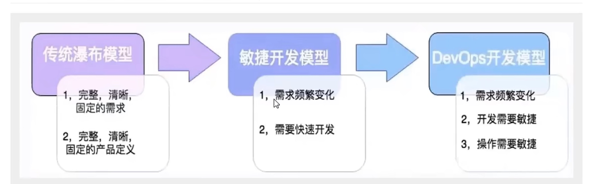
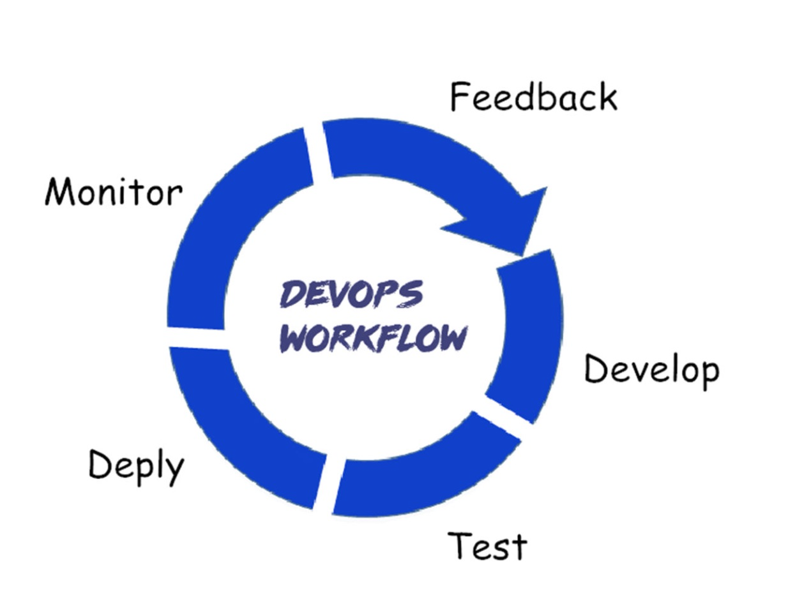

#知识管理/项目管理  

> [!NOTE] 什么是DevOps
> 一个完整的面向IT运维的工作流，以IT自动化以及持续集成(CI)、持续部署(CD)为基础，来优化程式开发、测试、系统运维等所有环境。
>  - 优化开发(DEV)、测试(QA)、运维(OPS)的流程，开发运维一体化
>  - 通过高度自动化工具与流程来使得软件构建、测试、发布和运维更加敏捷、频繁和可靠

## 三大支柱

- 人(People)
- 流程(Process)
- 平台(Platform)

DevOps = 人 + 流程 + 平台

流程 + 人 = 文化
流程 + 平台 = 工具
平台 + 人 = 赋能

> [!done] 优点
> - 代码的提交直接触发：消除等待时间，快速反馈
> - 全开发流程高效自动化：稳定，快速，交付结果可预测
> - 持续进行自动化回归测试：提升交付质量
> - 设施共享并按需提供：资源利用最大化

## DevOps工作流

## DevOps技术栈

- 代码管理（SCM）：GitHub、GitLab、BitBucket、SubVersion
- 构建工具：Ant、Gradle、maven
- 自动部署：Capistrano、CodeDeploy
- 持续集成（CI）：Bamboo、Hudson、Jenkins
- 配置管理：Ansible、Chef、Puppet、SaltStack、ScriptRock GuardRail
- 容器：Docker、LXC、第三方厂商如AWS
- 编排：Kubernetes、Core、Apache Mesos、DC/OS
- 服务注册与发现：Zookeeper、etcd、Consul
- 脚本语言：python、ruby、shell
- 日志管理：ELK、Logentries
- 系统监控：Datadog、Graphite、Icinga、Nagios
- 性能监控：AppDynamics、New Relic、Splunk
- 压力测试：JMeter、Blaze Meter、loader.io
- 预警：PagerDuty、pingdom、厂商自带如AWS SNS
- HTTP加速器：Varnish
- 消息总线：ActiveMQ、SQS
- 应用服务器：Tomcat、JBoss
- Web服务器：Apache、Nginx、IIS
- 数据库：MySQL、Oracle、PostgreSQL等关系型数据库；cassandra、mongoDB、redis等NoSQL数据库
- 项目管理（PM）：Jira、Asana、Taiga、Trello、Basecamp、Pivotal Tracker