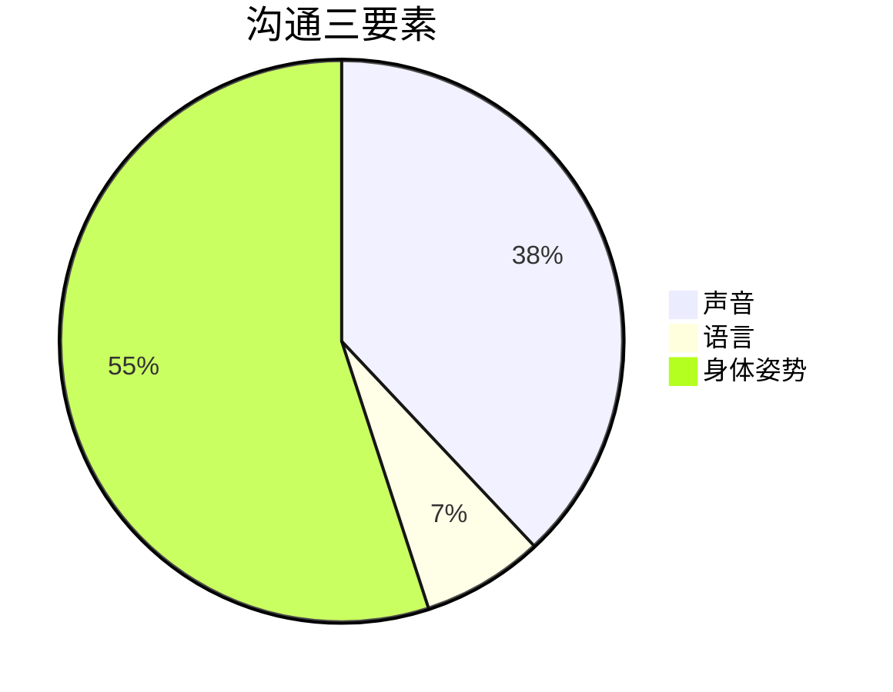

#知识管理/项目管理

## 管理即是沟通

开会：信息交流、建立共识、冲突解决、做出决策、建立关系

管理的四大基本职能：计划、组织、领导、控制(激励)
四个关键动作都需要沟通：信息收集、达成共识、做出决策、推动执行

**管理就是通过他人去完成任务的学问——彼得·德鲁克**

领导者通过团队完成任务，需要建立四共：

- 共识
	- 理性上的认同，目标、计划、策略是否理解
- 共鸣
	- 情感，表达方式
- 共振
	- 行动、执行、配合，进度监控，情绪管理，冲突管理
- 共赢
	- 利益分配，公平要有制度

**领导力是动员大家为了共同的远景努力奋斗的艺术**

## 管理沟通的五大要素

- 沟通者
	- 目的：信息通报、工作汇报、销售说服、商务谈判、面试、例会
	- 方式：陈述、说服、征询、参与
	- 三个标准：
		1. 是否有足够信息
		2. 是否需要他人意见
		3. 是否需要自己控制信息
	- 可信度：了解、信任、信心
	- 沟通者要素：
		1. 身份
		2. 良好意愿
		3. 专业知识
		4. 形象声誉
		5. 共同基础

- 沟通对象
	1. 谁？
	2. 了解并期待什么？
	3. 感觉如何？
	4. 如何说服他们：利益点是什么？

- 沟通的信息
	1. 信息结构，开始与结尾：过程管理，吸引，题目，观点，要点
	2. 信息组织：金字塔原理
	3. 记忆：记忆力
	4. 故事：抽象的事情具体化、生动化

- 沟通的渠道
	1. 纯文字沟通：邮件、短信、微信
	2. 纯口头沟通：电话、电话会议、语音、表达、混合渠道
	3. 混合式沟通

- 文化背景
	1. 时间：上班，周一
	2. 创业偏好：创业型无限可能，大企业
	3. 沟通方式：集权型组织、民主
	4. 可信度：信任的氛围
	5. 沟通对象选择：相关者
	6. 说服：有的文化喜欢说服
	7. 信息结构：有的领导喜欢书画
	8. 渠道选择：部门偏好，技术与市场
	9. 非语言行为
	10. 地点与空间：办公室、会议室、咖啡厅、非正式

沟通的四大目标：
1. 被听到
2. 被理解
3. 被接受
4. 使对方采取行动(改变行为或者态度)

## 沟通的四项基本原则

1. 先人后事：先处理情绪，再处理事情
2. 目的导向：适当干预、适当引导，聚焦于中心和目的，会议结束前两三分钟，需要总结本次沟通的目的，达成的成果，接下来采取的行动措施
3. 互动参与：所有与会者有参与感，贡献自己的价值
4. 3R原则(恰当的时间、恰当的地点、恰当的方式)

## 沟通的四种类型

1. 沟通的结构化思维
	1. 表达
	2. 倾听
	3. 总结
	4. 看

2. 演讲和表达的SUCCESS模型
	- Simple 简单
	- Un-excepted 意外惊喜
	- Clarity 清晰
	- Credibility 信誉
	- Emotion 情感
	- Story 故事
	- Structure 结构

3. 3F倾听模型
	1. Fact 事实
	2. Feeling 感受(情绪)
	3. Focus 意图

4. 写作与阅读的应用
	1. 计划：工作计划，项目计划
	2. 总结：项目总结，月度总结，季度总结，年终总结
	3. 汇报：项目汇报
	4. 结构：主题，观点，结构，论据，案例，数据

	商业计划书的基本结构：
	1. 市场分析：项目是什么，优点、亮点，现实的需求是什么，痛点是什么，能解决什么问题
	2. 产品技术分析：技术优点，能解决什么问题
	3. 竞争分析：国内国际有没有竞争对手，优势在哪里，技术更先进？性能指标更好？成本便宜？服务更好？
	4. 商业模式
	5. 战略规划：未来三年五年目标是什么，竞争策略是什么，如何建立竞争优势，建立壁垒
	6. 营销规划：如何获取客户，如何定价，促销策略
	7. 运营计划：如何生产，如何保证品质
	8. 人力资源与团队：核心团队是谁，经验如何，创业意愿如何，奋斗精神、创新能力、学习能力、未来一年三年需要多少人、需要什么样的人、从哪里获取、如何激励他们
	9. 财务与融资：需要多少钱启动项目未来三年五年，还需要追加多少资金，从银行获取还是从风险投资公司获取，愿意出让多少股权，未来三年五年，你的收入、增长率、利润率
	10. 风险管理：未来发展中客户、竞争对手、产品技术不成熟以及资金断裂

5. 全方位沟通与教练式沟通

**行为背后反映价值观和思想，用行为去影响他人**

教练式沟通：
1. 平等的关系：职务上有差异，但是人格上都是平等的
2. 互动的对话：双向的对话过程，共创话题与解决方案
3. 行动计划：今天谈论了什么话题？未来行动的计划，要达到什么样的结果
