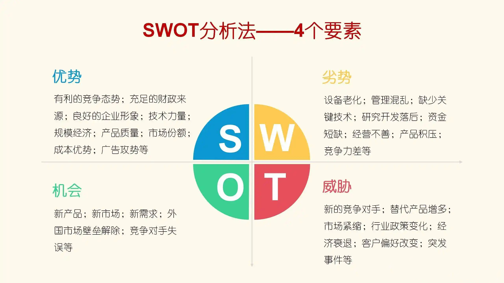
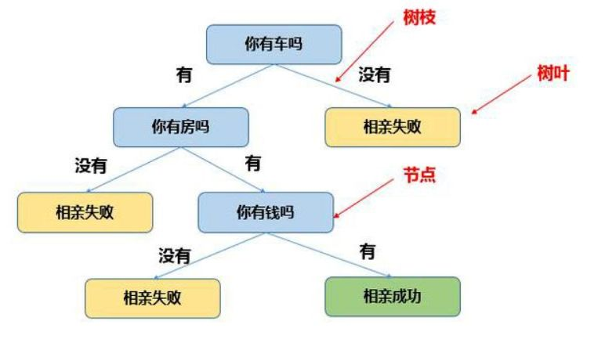

#知识管理/项目管理 

## 1. 什么是项目？

项目：是为了创造独特的产品、服务或成果而进行的临时性工作。
- 临时性
- 独特性
- 渐进明细(不确定、有风险)

## 2. 项目管理两大理论

- PMP
- ACP

## 3. 企业项目执行中的经典问题和挑战

1. 项目经理如何确保项目按时交付？
	1. 进度管理和时间管理
2. 如何协调关系人之间的需求与冲突？
	1. 项目相关方管理
3. 如何让干系人对项目目标达成一致和公式？
4. 如何获得项目干系人对项目目标的承诺？
5. 如何应对上级任意设定的项目工期？
	1. 未从项目实施的技术难度或者资源配置的角度去考虑
6. 如何应对人手不足与项目资源匮乏的问题？
7. 如何推动问题的整改(寻找创新的、建设性的解决方案)？
8. 如何鼓励项目干系人参与项目的计划与决策？
9. 如何提升项目团队的沟通、协作与配合？
10. 如何建立互信、尊重、有责任感的项目团队文化？

## 4. 如何选择项目生命周期模式

敏捷OR瀑布？

瀑布：简单
敏捷：复杂、模糊

## 5. 项目成功的标准

- 范围
- 质量
- 进度
- 预算
- 资源
- 风险
- 客户满意度
- 发起人满意度

## 6. 怎么才能管好一个项目？

- 整合管理：如何实现整体最优？根据活动目标裁剪出合适的过程、方法、工具，进行有效管理，从而达到有效管理，提现最优。
- 范围管理：做什么？确保围绕着预期目标来设计相应的活动方案，然后再进一步确定活动前、活动中、活动后分别要完成的具体工作。
- 进度管理：花多长时间？进度管理，就是说你要规划好阶段性步骤，同时明确每个里程碑的目标成果和时间安排。
- 成本管理：花多大代价？需要从全局视角去思考，如果更有效地管理项目的各项投入，以达到更加匹配目标的预期效果。
- 质量管理：达到什么要求？需要引入哪些必要的流程和方法，以保障活动效果的达成。
- 资源管理：有多少内部资源？比如宣传渠道、设计人员、经费支持、提供什么礼品、支援活动的志愿者
- 沟通管理：如何管理沟通？如果保持高效传递，使用什么方式来同步进展？
- 风险管理：如何应对风险？需要提前做好系统性的风险识别，分等级制定应对策略。
- 采购管理：有多少还要买？哪些需要外部采购，有哪些工作需要外部人员支持？如果经费有限，是否可以通过交互资源的方式，来获取更多的外部支持？
- 干系人管理：如何管理干系人，哪些人是你的干系人，预期效果什么。

## 7. 敏捷Scrum基本框架

## 8. 未来项目环境正在发生什么样的变化

## 9. 项目经理要做什么——三件事

1. 想打仗
	1. 激发危机感
	2. 激发责任感
	3. 明确责任与目标
	4. 转型领导
	5. 项目文化建设
	6. 搭班子、定战略、带队伍
2. 会打仗
	1. 工作设计与分解
	2. 管理模式转型
	3. 项目模式转型
	4. 创新与创造
	5. 执行推动与落地
	6. 干系人满意度提升
3. 能打仗
	1. 领导人才培养
	2. 专业人才使用
	3. 团队素质与能力提升
	4. 制度与流程构建
	5. 学习与改进提高

## 10. 合格项目经理需要具备哪些能力和素质？

- 专业技能
- 领导能力

## 11. 项目管理四阶段

1. 准备和启动阶段
	风险识别、战略制订
	

	相关方分析
	

	风险管理
	

3. 规划阶段
	WBS工作分解
	

	时间和成本估算
	类比估算：根据以往可比或者市面上已有的项目进行估算

	定性分析风险、排列优先级顺序
	概率影响矩阵
	
	
4. 执行和监控阶段
	冲突管理
	

	挣值分析
	如何在成本的执行过程中来洞察出未来项目完成还需要多少成本以及未来趋势的预估
	

	燃尽图
	进度展示工具
	

5. 收尾阶段
	- 最终报告
	- 经验教训总结
	- 文件归档

## 12. 从愚昧到大师

## 13. 项目管理能力需求树
点——工作
线——职业
面——行业
体——经济体

项目经理：
1. 执行组织委派领导团队实现项目目标的个人
2. 确保交付符合要求的项目成果，并对项目成败负责
3. 具备通用管理技能、应用领域技能、实践能力，以及良好的个人素质
4. 对促进干系人与项目之间的互动起核心作用

