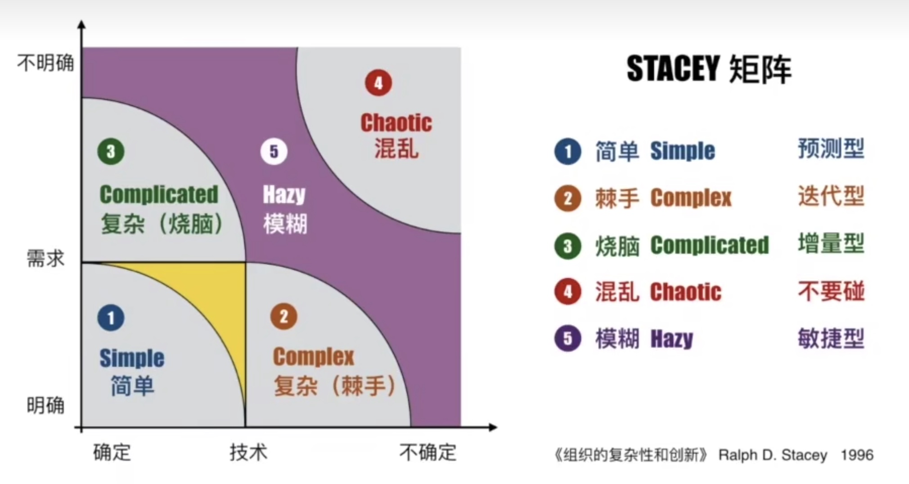

#知识管理/项目管理

## 传统的垂直管理模式

### 传统模式

- 以职能划分部门
- 树形结构
- 层级分明
- 垂直管理模式

## 项目为单元的精细管理模式

### 精细模式

- 矩阵模式
- 以项目为单元
- 面向战略
- 优化组织资源

## 项目，项目集和项目组合

战略(Strategy)：企业阶段性奋斗目标
项目组合(Portfolio)：为战略而组织在一起的项目
项目集(Porgram)：相关联的被协调管理的项目
项目(Project)：为实现具体目标而计划的工作

### 项目集

一组相关联且被协调管理的项目、子项目集和项目集活动，以便获得分别管理所无法获得的利益。

### 项目组合

为了实现战略目标而组合在一起管理的项目、项目集、子项目组合和运营工作。项目组合中的项目或项目集不一定彼此依赖或直接相关。

控制项目需要明确阶段和阶段关口，设置考核的里程碑，不光靠着日报、周报、月报。

## 项目生命周期

- 预测型(瀑布型)
- 迭代型
- 增量型
- 适应型(敏捷型)

### 预测型生命周期

### 增量型和迭代型

增量型每一部分交付都是一个完成状态，而迭代型是不断的完善细化。

### 适应型(敏捷型)

[敏捷开发](敏捷开发.md)

Scrum敏捷开发框架

### 项目生命周期的连续区间

### STACEY矩阵

## 项目的定义

为创作独特的产品、服务或成果而进行的临时性工作。

特征：

- 临时性
- 独特性
- 不确定性(风险)

### PPP

Public Private Partnership：公私合营

组织项目管理

## 项目相关方分析

### 凸显模型(Salience Model)

项目管理的核心：项目各方满意，取得项目相关方的共识